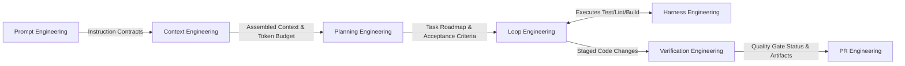
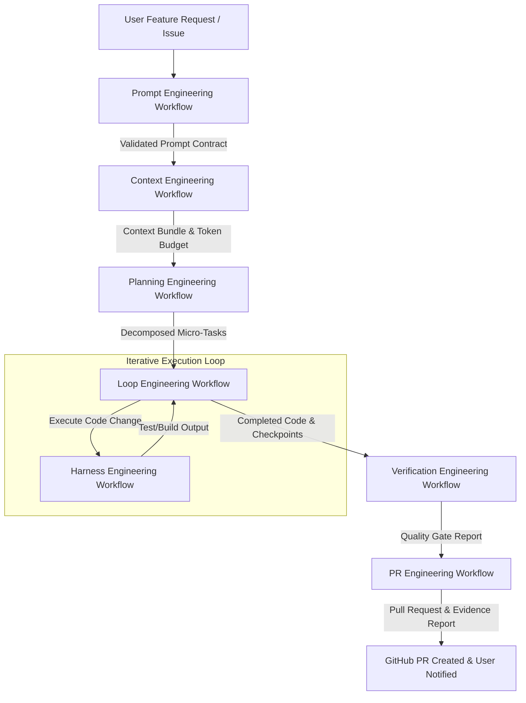
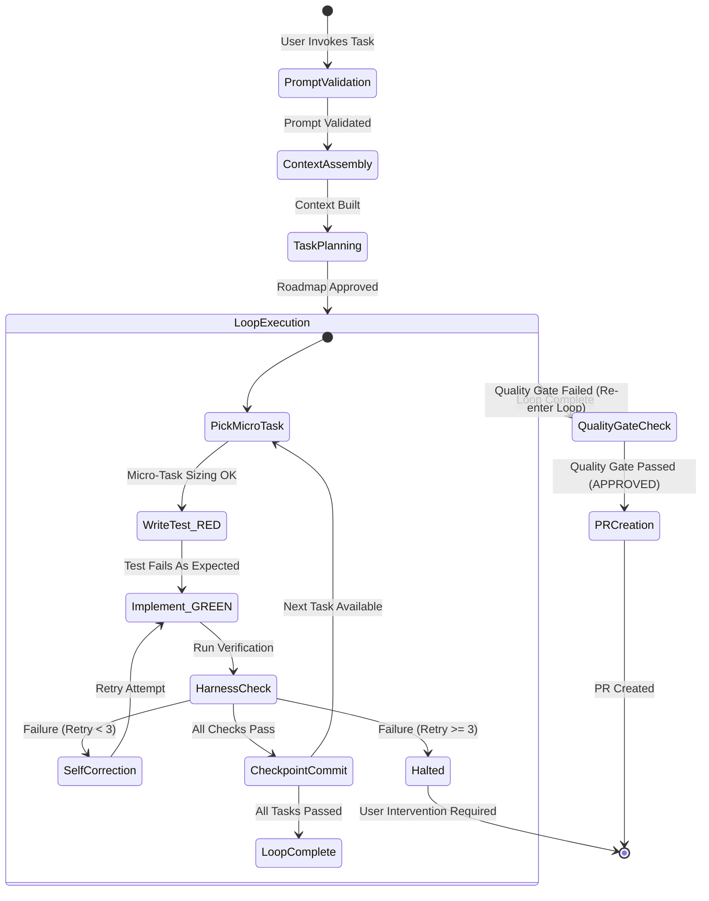

# Architecture Specification for Autonomous AI Workflows

This document presents the complete architecture of the autonomous software engineering workflow system.

---

## 1. Overall System Architecture

```mermaid
graph TD
    subgraph "Core Orchestration"
        PE["Prompt Engineering Workflow"]
        CE["Context Engineering Workflow"]
        PL["Planning Engineering Workflow"]
        LE["Loop Engineering Workflow"]
    end

    subgraph "Execution & Verification"
        HE["Harness Engineering Workflow"]
        VE["Verification Engineering Workflow"]
        PRE["PR Engineering Workflow"]
    end

    subgraph "Shared Foundation Layer"
        GL["Glossary (.agent/shared/glossary.md)"]
        DP["Design Principles (.agent/shared/design-principles.md)"]
        SG["Guardrails (.agent/shared/guardrails.md)"]
        PC["Project Config (.agent/shared/project-config.md)"]
    end

    PE --> CE
    CE --> PL
    PL --> LE
    LE <--> HE
    LE --> VE
    VE --> PRE

    PE -.-> Shared Foundation Layer
    CE -.-> Shared Foundation Layer
    PL -.-> Shared Foundation Layer
    LE -.-> Shared Foundation Layer
    HE -.-> Shared Foundation Layer
    VE -.-> Shared Foundation Layer
    PRE -.-> Shared Foundation Layer
```

---

## 2. Workflow Dependency Graph



---

## 3. Data Flow Diagram



---

## 4. State Transition Diagram



---

## 5. Recommended Execution Pipeline Order

| Step | Workflow Module | Primary Responsibilities |
|:---:|:---|:---|
| 1 | **Prompt Engineering** | Instruction design, role contracts, output validation, template optimization. |
| 2 | **Context Engineering** | Repository exploration, token budget tracking, context pruning, memory loading. |
| 3 | **Harness Engineering** | Environment execution, test running, linting, build checks, sandboxing. |
| 4 | **Planning Engineering** | Requirement breakdown, micro-task sizing, risk identification, roadmap generation. |
| 5 | **Loop Engineering** | Autonomous TDD execution, iteration management, self-correction, state checkpointing. |
| 6 | **Verification Engineering** | Architecture evaluation, security auditing, quality gates, performance checks. |
| 7 | **PR Engineering** | Change summarization, commit formatting, evidence collation, Pull Request generation. |

---

## 6. Directory Structure Overview

```
.agent/
├── shared/
│   ├── glossary.md
│   ├── design-principles.md
│   ├── guardrails.md
│   ├── project-config.md
│   └── architecture.md
└── workflows/
    ├── prompt-engineering.md
    ├── context-engineering.md
    ├── harness-engineering.md
    ├── planning-engineering.md
    ├── loop-engineering.md
    ├── verification-engineering.md
    └── pr-engineering.md
```
