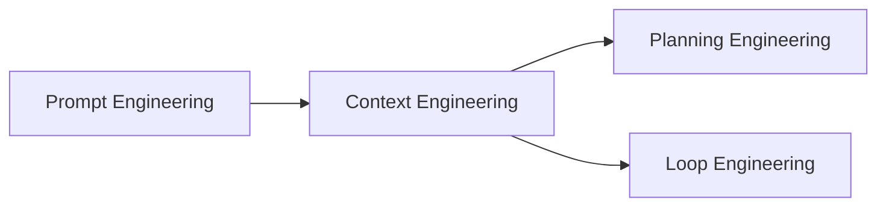
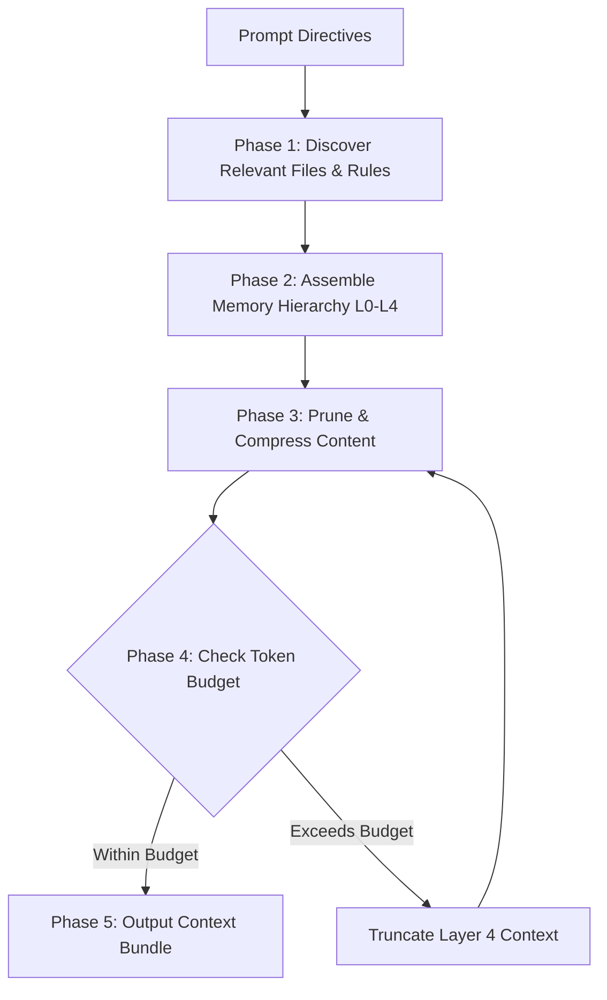

# Context Engineering Workflow (`/context-engineering`)

---

## Overview

### Purpose
The **Context Engineering Workflow** is responsible for discovering, filtering, assembling, pruning, and refreshing repository context required by an autonomous AI agent. It ensures the agent operates with exact, highly relevant repository state while staying within model token budgets.

### Responsibilities
* Context Discovery: Scanning workspace files, rules, skills, workflows, and git logs.
* Memory Hierarchy Management: Structuring context into core rules, domain guidelines, task context, and transient state.
* Context Pruning & Compression: Removing irrelevant code, whitespace, and truncated logs to optimize token usage.
* Token Budget Management: Allocating context windows efficiently across task phases.
* Context Refresh: Dynamically refreshing stale context during long-running execution loops.

### When to Use
* Immediately after Prompt Engineering to assemble context for planning or execution.
* Before major code modification steps to load target file dependencies.
* Periodically during long-running autonomous loops when context drift occurs.

### When NOT to Use
* For generating code modifications directly (delegate to Loop Engineering).
* For running CLI verification commands (delegate to Harness Engineering).

---

## Inputs

| Input Parameter | Type | Required | Description |
|:---|:---|:---:|:---|
| `ValidatedPrompt` | Text | Yes | Prompt output from Prompt Engineering |
| `TargetFiles` | Array | No | Specific files targeted for analysis or modification |
| `TokenBudget` | Number | No | Max token count allowed for context assembly (default: 32,000 tokens) |
| `MemoryLayers` | Array | No | Specified layers to load (e.g., `["rules", "skills", "code"]`) |

---

## Outputs

| Output Parameter | Format | Description |
|:---|:---|:---|
| `ContextBundle` | Markdown / JSON | Fully assembled, pruned, and structured context package |
| `TokenUsageReport` | JSON | Breakdown of token counts per loaded context section |
| `FileTreeSnapshot` | Text | Relevant workspace directory structure snapshot |
| `StaleContextAlert` | Boolean / String | Indicator if cached context needs re-reading from disk |

---

## Dependencies

* **Upstream**: Prompt Engineering (provides directives for context selection)
* **Downstream**: Planning Engineering, Loop Engineering (consume the assembled ContextBundle)

---

## Internal Phases

### Phase 1: Repository Discovery & File Scanning
* **Objective**: Identify relevant workspace files, documentation, and agent rules.
* **Actions**:
  1. Scan `.agent/rules/`, `.agent/skills/`, and `.agent/shared/` for applicable guidelines.
  2. Locate target implementation files and their direct dependencies (`imports`/`exports`).
* **Success Criteria**: Complete file list of targeted source files and rules.

### Phase 2: Memory Hierarchy Assembly
* **Objective**: Structure loaded information by priority level.
* **Hierarchy Layers**:
  1. **Layer 0 (Highest)**: Core Safety & System Rules (`.agent/shared/guardrails.md`).
  2. **Layer 1**: Task Specifications & Acceptance Criteria (`implementation_plan.md`).
  3. **Layer 2**: Relevant Skills & Workflows (`.agent/workflows/*`).
  4. **Layer 3**: Target Source Code Files & Tests.
  5. **Layer 4 (Lowest)**: Historical Transcripts & Search Results.
* **Success Criteria**: Context ordered strictly by hierarchy priority.

### Phase 3: Pruning & Compression
* **Objective**: Remove redundant information to minimize token consumption.
* **Actions**:
  1. Strip unnecessary comments, duplicate whitespace, and unneeded test fixtures.
  2. Summarize large documentation files into key actionable bullets.
* **Success Criteria**: 30-50% reduction in context size with zero loss of critical semantics.

### Phase 4: Token Budget Allocation
* **Objective**: Ensure assembled bundle fits safely within model limits.
* **Actions**:
  1. Calculate total token count of assembled memory layers.
  2. Truncate lowest priority layers (Layer 4) if total exceeds `TokenBudget`.
* **Success Criteria**: `TotalTokens <= TokenBudget`.

### Phase 5: Context Refresh (Long-Running Support)
* **Objective**: Prevent context drift during multi-step execution.
* **Actions**:
  1. Re-read modified files from disk after each Loop Engineering step.
  2. Invalidate stale file representations in memory.
* **Success Criteria**: Context bundle reflects exact disk state.

---

## Execution Rules

1. **Hierarchy First**: Safety guardrails MUST ALWAYS occupy the highest priority layer in context.
2. **Relative Paths Only**: File paths inside context bundles MUST use project-relative formatting.
3. **No Hallucinated Schemas**: File contents MUST be read directly from source files using file inspection tools.
4. **Token Limit Enforcement**: Context bundles MUST NOT exceed the specified `TokenBudget`.

---

## Guardrails

* **Secret Masking**: Automatically filter out credentials, `.env` values, or API keys from loaded context text.
* **Sanitization Check**: Ensure no absolute machine paths (`C:\Users\...`) leak into assembled context bundles.

---

## Best Practices

* Inspect authoritative source files directly rather than relying on stale memory summaries.
* Keep transient log context separate from core rules to preserve token space for reasoning.
* Use git diffs (`git diff --staged`) to load minimal focused context during reviews.

---

## Anti-Patterns

* ❌ **Context Flooding**: Reading the entire repository codebase into context at once.
* ❌ **Ignoring Token Limits**: Allowing token usage to exceed 90% of model window capacity.
* ❌ **Stale Context Persistence**: Re-using file contents cached 10 steps ago after edits have occurred.

---

## Mermaid Diagram

---

## Integration Points

* **Prompt Engineering**: Receives prompt specifications to drive search queries.
* **Planning Engineering**: Supplies context bundles for feature analysis and roadmap generation.
* **Loop Engineering**: Periodically refreshed by Context Engineering after file edits.

---

## Extensibility

* **Vector Search / RAG Extension**: Future context engineering modules can integrate semantic search or vector database queries into Phase 1 without changing downstream interfaces.
