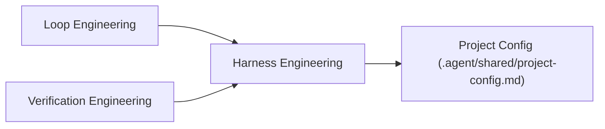
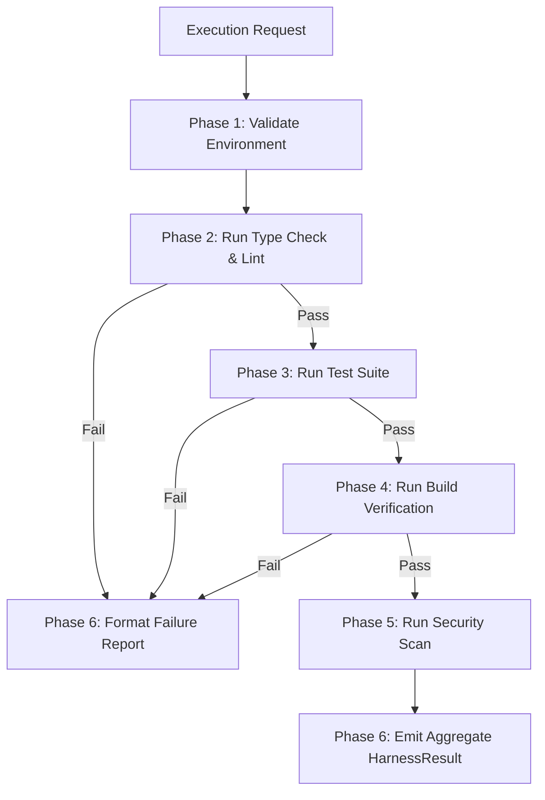

# Harness Engineering Workflow (`/harness-engineering`)

---

## Overview

### Purpose
The **Harness Engineering Workflow** provides a secure, reliable execution environment for running validation commands (tests, type checkers, linters, static analyzers, compilers, and security scanners). It abstracts environment-specific CLI calls using project-level configuration mappings (`.agent/shared/project-config.md`).

### Responsibilities
* Sandbox & Environment Validation: Verifying prerequisites before executing shell operations.
* Test Execution: Invoking unit, integration, and E2E test suites (`{{TEST_COMMAND}}`).
* Static Type & Syntax Analysis: Running canonical type-checkers (`{{TYPE_CHECK_COMMAND}}`) and linters (`{{LINT_COMMAND}}`).
* Build Verification: Running compilation and production bundle builds (`{{BUILD_COMMAND}}`).
* Security Scanning: Executing vulnerability scans (`{{SECURITY_SCAN_COMMAND}}`).
* Execution Isolation & Result Parsing: Capturing exit codes and parsing stdout/stderr into machine-readable reports.

### When to Use
* Invoked by Loop Engineering to verify implementation steps.
* Invoked by Verification Engineering to perform quality gate validation.
* Invoked before creating PRs to ensure full build and test integrity.

### When NOT to Use
* For generating code edits or modifying repository logic directly.
* For defining overall task roadmaps or user stories.

---

## Inputs

| Input Parameter | Type | Required | Description |
|:---|:---|:---:|:---|
| `TargetChecks` | Array | Yes | Suite of checks to run (e.g., `["test", "typecheck", "lint", "build"]`) |
| `ScopeFiles` | Array | No | Specific files or directories to filter test/lint targets |
| `CoverageRequired` | Boolean | No | Whether to calculate code coverage (default: `true`) |
| `EnvironmentOverrides` | Dictionary | No | Environment variables required for execution |

---

## Outputs

| Output Parameter | Format | Description |
|:---|:---|:---|
| `HarnessResult` | JSON | Aggregate pass/fail status and breakdown of check results |
| `TestSummary` | JSON | Passed/failed test counts, failed assertion snippets, coverage % |
| `TypeCheckErrors` | Array | Parsed list of TypeScript / compiler errors with line numbers |
| `LintErrors` | Array | Parsed list of linter violations |
| `RawLogs` | Text | Un-truncated console stdout/stderr log output |

---

## Dependencies

* **Upstream**: Loop Engineering, Verification Engineering (request execution of validation checks)
* **Downstream**: Project Config (provides abstract command mappings: `{{TEST_COMMAND}}`, `{{TYPE_CHECK_COMMAND}}`, etc.)

---

## Internal Phases

### Phase 1: Environment & Prerequisite Validation
* **Objective**: Confirm execution sandbox and dependencies are clean.
* **Actions**:
  1. Verify working directory matches workspace root.
  2. Check availability of runtime tools (`node`, `npm`, `vitest`, `tsc`).
* **Success Criteria**: All prerequisite binaries present and responsive.

### Phase 2: Static Analysis & Type Checking
* **Objective**: Ensure code type safety and syntax correctness.
* **Actions**:
  1. Execute `{{TYPE_CHECK_COMMAND}}`.
  2. Execute `{{LINT_COMMAND}}`.
* **Success Criteria**: Zero type errors (`0` exit code) and zero critical lint violations.

### Phase 3: Test Execution & Coverage Calculation
* **Objective**: Verify functional behavior and measure code coverage.
* **Actions**:
  1. Execute `{{TEST_COMMAND}}` or `{{TEST_COVERAGE_COMMAND}}`.
  2. Parse test runner output for failures and coverage metrics.
* **Success Criteria**: 100% of tests pass; coverage meets `{{COVERAGE_THRESHOLD}}`%.

### Phase 4: Build Compilation Verification
* **Objective**: Verify project compiles cleanly without bundling errors.
* **Actions**:
  1. Execute `{{BUILD_COMMAND}}`.
* **Success Criteria**: Successful build artifact generation (`0` exit code).

### Phase 5: Security & Vulnerability Scan
* **Objective**: Check dependencies for known security vulnerabilities.
* **Actions**:
  1. Execute `{{SECURITY_SCAN_COMMAND}}`.
* **Success Criteria**: Zero critical or high severity vulnerability flags.

### Phase 6: Report Aggregation & Machine Output Parsing
* **Objective**: Format execution findings into machine-readable structured JSON.
* **Actions**:
  1. Aggregate outputs into standard `HarnessResult` schema.
* **Success Criteria**: Machine-readable JSON output emitted to calling workflow.

---

## Execution Rules

1. **Abstract Commands Only**: Harness Engineering MUST execute commands via `.agent/shared/project-config.md` variables.
2. **Un-truncated Error Logs**: Upon command failure, full error tracebacks MUST be captured for diagnostic analysis.
3. **No Silent Swallowing**: Non-zero exit codes MUST NEVER be ignored or masked as successful execution.
4. **Clean Execution Directory**: Commands MUST be executed from the proper relative workspace directory (`./web`, etc.).

---

## Guardrails

* **Timeout Enforcer**: Cap command execution at 5 minutes per verification phase to prevent hangs.
* **Sandbox Isolation**: Prevent commands from writing files outside the designated workspace bounds.
* **Mask Secret Variables**: Redact environment secrets from command output before emitting logs.

---

## Best Practices

* Run lightweight static type checks before running heavy integration test suites to fail fast.
* Focus test execution on modified files during iterative loops, running the full suite only before final PR creation.

---

## Anti-Patterns

* ❌ **Hardcoded CLI Commands**: Hardcoding `npx vitest run` instead of using `{{TEST_COMMAND}}`.
* ❌ **Masking Failures**: Returning success when tests fail by catching errors silently.
* ❌ **Ignoring Truncated Tracebacks**: Attempting to fix bugs without fetching full un-truncated error logs.

---

## Mermaid Diagram

---

## Integration Points

* **Loop Engineering**: Called continuously during TDD cycles to check test results.
* **Verification Engineering**: Called to run full regression tests and quality gate audits.
* **Project Config**: Serves as the source of truth for command bindings (`{{...}}`).

---

## Extensibility

* **Container / Docker Harness Extension**: Phase 1 can be extended to launch ephemeral Docker containers or VM sandboxes for non-JS/Node environments.
