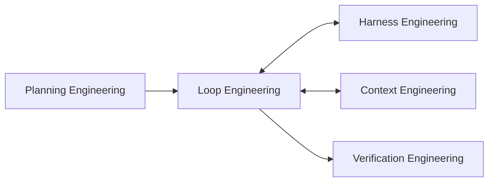
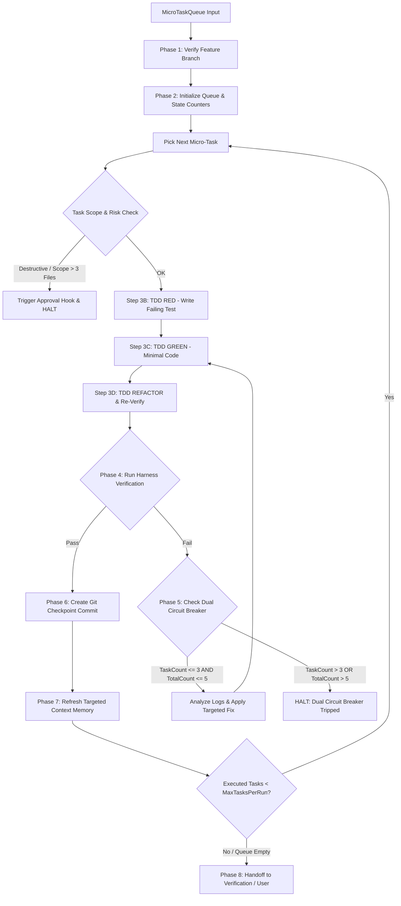

# Loop Engineering Workflow (`/loop-engineering`)

---

## Overview

### Purpose
The **Loop Engineering Workflow** is the core autonomous execution engine of the agent operating system. It consumes decomposed micro-task queues from Planning Engineering and executes them iteratively using Test-Driven Development (TDD), automated Harness verification, self-correction, git checkpointing, and periodic context refresh.

### Responsibilities
* Execution Loop Orchestration: Iterating through task queues step-by-step.
* TDD Cycle Management: Enforcing RED (test first) → GREEN (minimal implementation) → REFACTOR.
* Self-Correction & Failure Analysis: Diagnosing error tracebacks and applying targeted fixes.
* Retry Policy Enforcement: Halting via Circuit Breaker if an error fails 3 consecutive retries.
* Checkpointing & State Management: Creating git commits after each verified step.
* Context Refresh: Re-reading modified files to maintain exact disk state in memory.

### When to Use
* For executing feature implementations, bug fixes, or refactoring roadmaps step-by-step.
* When running multi-step development tasks autonomously after planning approval.

### When NOT to Use
* Directly on `main` branch.
* Without prior planning or task decomposition (run Planning Engineering first).

---

## Inputs

| Input Parameter | Type | Required | Description |
|:---|:---|:---:|:---|
| `MicroTaskQueue` | Array of JSON | Yes | List of XS/S sized micro-tasks from Planning Engineering |
| `AcceptanceCriteria` | Array | Yes | Testable completion criteria for each micro-task |
| `MaxTaskRetries` | Number | No | Max consecutive retries for a single task error (default: `3`) |
| `TotalRetryBudget` | Number | No | Max cumulative retries across the entire loop (default: `5`) |
| `MaxTasksPerRun` | Number | No | Max micro-tasks executed per single loop run (default: `5`) |
| `MaxModifiedFilesPerTask` | Number | No | Max files allowed to be edited per task (default: `3`) |
| `ContextRefreshInterval` | Number | No | Step interval for context refreshing (default: `1 step`) |

---

## Outputs

| Output Parameter | Format | Description |
|:---|:---|:---|
| `LoopExecutionReport` | Markdown | Comprehensive report of executed tasks, test results, and commits |
| `CheckpointsLog` | Array of JSON | List of git commit SHAs generated during loop execution |
| `HaltedStateData` | JSON / Null | Failure diagnosis and error trace if loop was halted by Circuit Breaker |

---

## Dependencies

* **Upstream**: Planning Engineering (supplies task queue)
* **Downstream**: Harness Engineering (invoked for test/type verification), Context Engineering (invoked for context refresh), Verification Engineering (invoked upon loop completion)

---

## Internal Phases

### Phase 1: Pre-Loop Validation & Branch Protection
* **Objective**: Ensure safe execution environment before file edits.
* **Actions**:
  1. Verify active branch is NOT `main`.
  2. Confirm working tree is clean or has stash checkpoint.
* **Success Criteria**: Active branch matches `feat/*` or `fix/*`.

### Phase 2: Task Queue Initialization & State Setup
* **Objective**: Load micro-tasks and initialize cost/retry state trackers.
* **Actions**:
  1. Initialize `TaskQueue`, `CompletedTasks`.
  2. Initialize state counters: `TaskRetryCount = 0`, `TotalRetryCount = 0`, `ExecutedTaskCount = 0`.
* **Success Criteria**: Queue loaded; counters zeroed; budget limits registered.

### Phase 3: Iterative TDD & Implementation Loop
For each micro-task in `TaskQueue` (up to `MaxTasksPerRun` limit):

1. **Step A: High-Risk Action & Scope Pre-Check**
   - Check task scope: Ensure target files count <= `MaxModifiedFilesPerTask` (default 3 files).
   - Check destructive operations: If task requires deleting core files/directories or DB resets, HALT and trigger **Approval Hook** ([guardrails.md §5](file://./.agent/shared/guardrails.md#L46-L53)).
2. **Step B: TDD RED (Write/Update Test)**
   - Write failing unit/integration test covering expected behavior.
   - Invoke Harness Engineering to verify test **FAILS** for the right reason.
3. **Step C: TDD GREEN (Minimal Implementation)**
   - Write minimal production code required to satisfy the test.
   - Invoke Harness Engineering to verify test **PASSES**.
4. **Step D: TDD REFACTOR & Re-Verification**
   - Clean code, improve names, ensure immutability while keeping tests green.
   - Re-invoke Harness Engineering (`TargetChecks: ["test", "typecheck"]`) to verify refactoring introduced zero regressions.

### Phase 4: Automated Verification & Diagnostic Catch
* **Objective**: Validate correctness via Harness Engineering and update state counters.
* **Actions**:
  1. Invoke Harness Engineering (`TargetChecks: ["test", "typecheck"]`).
  2. If PASS: Reset `TaskRetryCount = 0`, increment `ExecutedTaskCount++`, proceed to Phase 6.
  3. If FAIL: Increment `TaskRetryCount++` AND `TotalRetryCount++`, proceed to Phase 5.

### Phase 5: Self-Correction & Dual Circuit Breaker Logic
* **Objective**: Diagnose failure logs and apply targeted fixes or trigger circuit breaker.
* **Actions**:
  1. Inspect un-truncated stdout/stderr error logs from Harness.
  2. Formulate root-cause hypothesis (never mask symptoms or delete tests).
  3. **Circuit Breaker Evaluation**:
     - If `TaskRetryCount <= MaxTaskRetries` AND `TotalRetryCount <= TotalRetryBudget`: Apply targeted fix and return to Phase 3.
     - If `TaskRetryCount > MaxTaskRetries` OR `TotalRetryCount > TotalRetryBudget`: **HALT EXECUTION IMMEDIATELY**, emit `HaltedStateData`, and request human intervention.

### Phase 6: Checkpointing & State Commit
* **Objective**: Save progress securely.
* **Actions**:
  1. Stage changed files (`git add <files>`).
  2. Commit using Conventional Commits (`git commit -m "<type>(<scope>): <description>"`).
* **Success Criteria**: Clean git status; new commit SHA logged.

### Phase 7: Targeted Context Refresh & Token Budget Control
* **Objective**: Refresh memory efficiently without consuming excessive tokens.
* **Actions**:
  1. Invoke Context Engineering to re-read **ONLY modified files** from Phase 6 checkpoint.
  2. Prune obsolete stack trace logs from memory to maintain token budget.
* **Success Criteria**: Agent context updated with exact disk state at minimal token cost.

### Phase 8: Loop Completion & Handoff
* **Objective**: Transition to Verification Engineering when queue is empty or `MaxTasksPerRun` limit reached.
* **Actions**:
  1. Check queue completion or run limits (`ExecutedTaskCount >= MaxTasksPerRun`).
  2. Emit `LoopExecutionReport` to Verification Engineering or User.

---

## Execution Rules

1. **Never Skip RED Phase**: Tests MUST be written and verified failing before writing business logic.
2. **No Superficial Patches**: NEVER fix errors by swallowing exceptions, deleting failing assertions, or disabling type checks.
3. **Strict Retry Hard Stop**: STOP immediately when single-task retries fail 3 times OR cumulative loop retries reach 5.
4. **Scope & Task Caps**: STOP loop execution after 5 micro-tasks or if a single task touches > 3 files.
5. **Clean Checkpoints Only**: Commits MUST NOT be created if unit tests or type checks are failing.

---

## Guardrails

* **Branch Gate**: Halt if active branch is `main`.
* **Dual Circuit Breaker**: Hard limit of 3 retries per task failure and 5 cumulative retries per execution session.
* **Cost & Scope Limit**: Cap continuous execution at 5 tasks and 3 files per task to prevent token/cost inflation.
* **Approval Hook**: Halt and request user approval before executing destructive actions (directory removal, DB resets).
* **Rollback Command**: In the event of a circuit breaker trip, provide `git reset --hard <last-checkpoint-sha>` instructions to user.

---

## Best Practices

* Keep micro-tasks small (XS/S) so each iteration takes < 5 minutes and modifies <= 3 files.
* Run focused tests during iteration loops, saving full suite execution for final completion.
* Prune large test outputs from agent memory between checkpoints to optimize token usage.

---

## Anti-Patterns

* ❌ **Infinite Fixing Loops**: Trying 10+ random changes without diagnosing root causes.
* ❌ **Token Waste Batching**: Editing 5+ files or running 10+ tasks in a single un-checkpointed loop.
* ❌ **Test Masking**: Modifying test expectations to force a broken implementation to pass.
* ❌ **Memory Bloat**: Retaining thousands of lines of raw test stdout in prompt history.

---

## Mermaid Diagram

---

## Integration Points

* **Planning Engineering**: Source of structured task queues.
* **Harness Engineering**: Invoked after every code edit to execute tests/type-checks.
* **Context Engineering**: Invoked after checkpoints to refresh disk state in memory.
* **Verification Engineering**: Receives completed codebase for final quality gate review.

---

## Extensibility

* **Parallel Task Execution Subagents**: Future extensions can spawn parallel sub-agent loops for non-overlapping micro-tasks across decoupled subdirectories.
