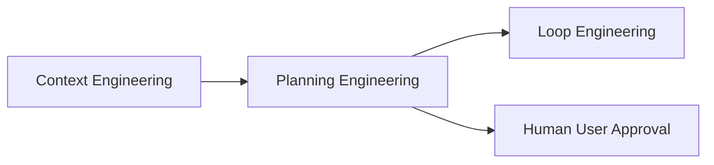
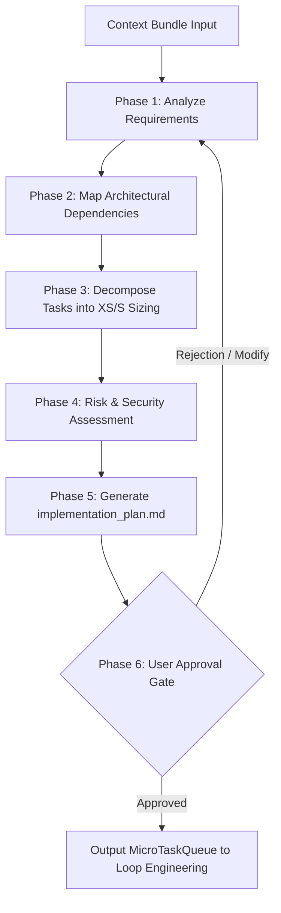

# Planning Engineering Workflow (`/planning-engineering`)

---

## Overview

### Purpose
The **Planning Engineering Workflow** converts high-level feature requests, user stories, or bug reports into structured, actionable implementation plans. It decomposes complex engineering goals into small, testable micro-tasks (Size **XS** or **S**) and maps technical risks before code modification begins.

### Responsibilities
* Requirement Analysis & Scope Definition: Clarifying functional goals and non-functional constraints.
* Architectural & Dependency Graph Mapping: Identifying files, modules, and API boundaries affected.
* Task Breakdown & Micro-Task Sizing: Decomposing tasks into XS (< 1h) or S (1-2h) work units.
* Technical Risk Assessment: Identifying security vulnerabilities, breaking changes, and state side-effects.
* Implementation Roadmap Generation: Producing formal `implementation_plan.md` artifacts.
* User Approval Protocol: Halting execution to present proposed plans for human consent.

### When to Use
* Whenever starting a new feature, complex refactoring, or multi-step bug fix.
* When a user request involves ambiguous requirements, architectural changes, or risk.

### When NOT to Use
* For trivial one-off tweaks (e.g., fixing a typo, updating a single comment).
* For executing code implementation directly (delegate to Loop Engineering).

---

## Inputs

| Input Parameter | Type | Required | Description |
|:---|:---|:---:|:---|
| `ContextBundle` | Object | Yes | Assembled context bundle from Context Engineering |
| `UserRequest` | String | Yes | Feature specification or issue description |
| `ArchitectureRules` | Array | No | Project architectural guidelines and coding standards |

---

## Outputs

| Output Parameter | Format | Description |
|:---|:---|:---|
| `ImplementationPlan` | Markdown Artifact | Formal `implementation_plan.md` document with step-by-step roadmap |
| `MicroTaskQueue` | Array of JSON | Structured list of XS/S micro-tasks ready for Loop Engineering |
| `DependencyGraph` | Mermaid / Text | File and component dependency relationship map |
| `RiskAssessmentReport` | Markdown | Identified technical risks, security constraints, and mitigation strategies |

---

## Dependencies

* **Upstream**: Context Engineering (supplies workspace files, rules, and token-budgeted context)
* **Downstream**: Loop Engineering (receives `MicroTaskQueue` for iterative implementation)

---

## Internal Phases

### Phase 1: Requirement Analysis & Scope Definition
* **Objective**: Define exact functional targets and eliminate ambiguity.
* **Actions**:
  1. Parse `UserRequest` against project architecture rules.
  2. Identify ambiguities; formulate targeted clarification questions if essential.
* **Success Criteria**: Clear problem statement and objective summary.

### Phase 2: Architectural Mapping & Dependency Graphing
* **Objective**: Trace files and components affected by proposed changes.
* **Actions**:
  1. Map module dependencies, imported types, and API endpoint contracts.
  2. Generate visual component dependency graph.
* **Success Criteria**: Complete list of files to create, modify, or delete.

### Phase 3: Task Decomposition & Micro-Task Sizing
* **Objective**: Break goals down into small, low-risk execution units.
* **Sizing Standards**:
  - **XS (< 1h)**: Single function, simple utility, unit test creation.
  - **S (1-2h)**: Component scaffold, API route implementation, state model update.
  - **M (Half day)**: *Recommend splitting into XS/S tasks*.
  - **L (1 day+)**: *MUST be split into multiple child tasks*.
* **Success Criteria**: 100% of micro-tasks sized XS or S.

### Phase 4: Risk Analysis & Security Impact Assessment
* **Objective**: Identify potential security risks, breaking changes, and failure modes.
* **Actions**:
  1. Evaluate XSS, injection, authentication, and data privacy impact.
  2. Verify paths use relative formatting (`./web/...`) to prevent path leaks.
* **Success Criteria**: Risk mitigation strategy defined for all identified risks.

### Phase 5: Implementation Roadmap & Artifact Generation
* **Objective**: Write formal `implementation_plan.md` artifact.
* **Actions**:
  1. Create document using standard implementation plan template.
  2. Set `ArtifactMetadata` (`RequestFeedback: true`, `UserFacing: true`).
* **Success Criteria**: Validated `implementation_plan.md` artifact saved to workspace.

### Phase 6: Human-in-the-Loop Approval Gate
* **Objective**: Obtain explicit user authorization before code editing begins.
* **Actions**:
  1. Present plan proposal template to user.
  2. **HALT execution** until user approves (`Yes` / `Proceed`).
* **Success Criteria**: Explicit user approval received.

---

## Execution Rules

1. **Strict Task Sizing**: Plans MUST NOT contain tasks sized M or L; all tasks MUST be decomposed to XS or S.
2. **Approval Mandatory**: Code modifications MUST NOT begin until the plan is explicitly approved by the user.
3. **Relative Paths Only**: File targets in implementation plans MUST use project-relative paths.
4. **No Hidden Assumptions**: Unknown schema details MUST be investigated using Context Engineering before planning.

---

## Guardrails

* **Branch Gate**: Verify target branch is a feature branch (`feat/*`, `fix/*`) before outputting plan.
* **No Direct Edit Phase**: Planning Engineering MUST NOT write or modify application source code directly.

---

## Best Practices

* Use GitHub alerts (`> [!IMPORTANT]`, `> [!WARNING]`) to highlight key design decisions or breaking changes.
* Order micro-tasks logically: interface/type definitions first, test scaffolding second, implementation third.

---

## Anti-Patterns

* ❌ **Monolithic Tasks**: Creating a single task "Build user authentication feature".
* ❌ **Bypassing User Approval**: Writing implementation code before plan approval.
* ❌ **Speculative Planning**: Guessing API endpoint schemas without verifying authoritative source files.

---

## Mermaid Diagram

---

## Integration Points

* **Context Engineering**: Supplies repository structure and dependency context for planning.
* **Loop Engineering**: Consumes `MicroTaskQueue` to drive step-by-step execution.
* **Verification Engineering**: Uses plan acceptance criteria to evaluate quality gates.

---

## Extensibility

* **WBS / Issue Exporter**: Can be extended to automatically generate individual GitHub Issues for each decomposed micro-task using GitHub CLI (`gh issue create`).
