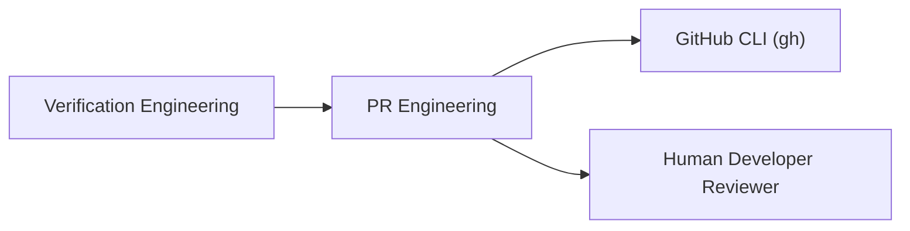
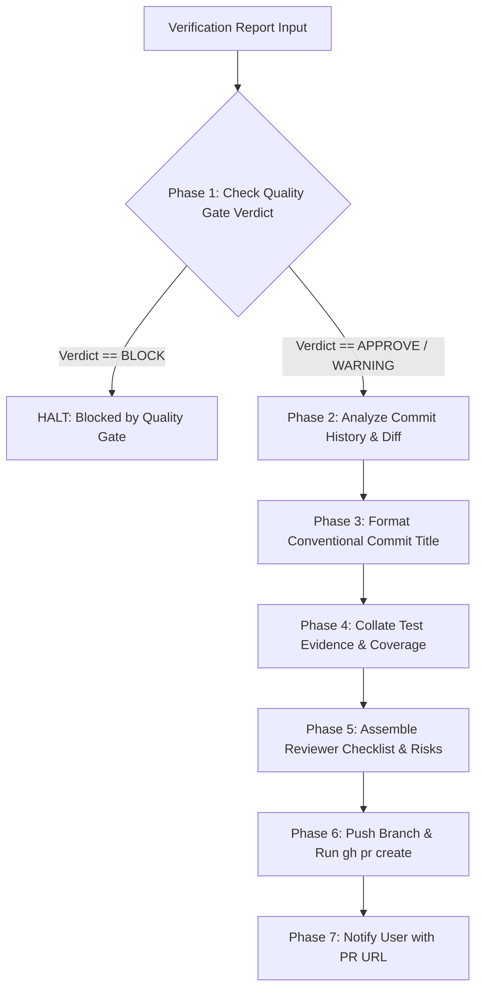

# PR Engineering Workflow (`/pr-engineering`)

---

## Overview

### Purpose
The **PR Engineering Workflow** automates the packaging, summarization, evidence collation, and opening of GitHub Pull Requests. It ensures that every PR submitted by an autonomous AI agent is well-structured, contains verifiable test evidence, adheres to Conventional Commits, and complies with safety policies.

### Responsibilities
* Commit History Analysis: Analyzing full branch commit history (not just latest commit).
* Change Summary & Release Notes Drafting: Writing clear, human-readable explanations of changes.
* Conventional Commit Enforcement: Validating PR titles and commit formats (`<type>(<scope>): <description>`).
* Test Evidence Collation: Embedding unit test, type-check, and coverage verification output into PR bodies.
* Reviewer Checklist & Risk Summary: Providing automated checklist and risk assessment for human reviewers.
* PR Creation: Executing `gh pr create` with validated parameters.

### When to Use
* Upon successful completion of Verification Engineering (`QualityGateVerdict` = `APPROVE` or `WARNING`).
* When ready to submit feature branches for human code review.

### When NOT to Use
* If Verification Engineering issued a `BLOCK` verdict (resolve issues first).
* For pushing directly to `main` branch (NEVER push directly to main).

---

## Inputs

| Input Parameter | Type | Required | Description |
|:---|:---|:---:|:---|
| `QualityGateVerdict` | Enum | Yes | Must be `APPROVE` or `WARNING` from Verification Engineering |
| `VerificationReport` | Object | Yes | Detailed verification metrics, test coverage, and security audit |
| `TargetBaseBranch` | String | No | Target base branch for PR (default: `main`) |
| `PRTemplatePath` | String | No | Path to PR template (default: `.github/pull_request_template.md`) |

---

## Outputs

| Output Parameter | Format | Description |
|:---|:---|:---|
| `PullRequestURL` | String | Web URL of the newly created GitHub Pull Request |
| `PullRequestBody` | Markdown | Rendered PR body containing summary, evidence, and checklist |
| `PRSubmissionReport` | JSON | Machine-readable metadata of submitted PR (PR #, branch, status) |

---

## Dependencies

* **Upstream**: Verification Engineering (provides `QualityGateVerdict` and `VerificationReport`)
* **Downstream**: GitHub CLI (`gh`), Human Developer (notified to review PR)

---

## Internal Phases

### Phase 1: Pre-Submission Verification Check
* **Objective**: Confirm quality gate status before creating PR.
* **Actions**:
  1. Check `QualityGateVerdict`. If `BLOCK`, halt immediately.
  2. Verify working tree status and active branch.
* **Success Criteria**: Verdict is `APPROVE` or `WARNING`; active branch is `feat/*`, `fix/*`, etc.

### Phase 2: Commit History & Change Analysis
* **Objective**: Aggregate full history of changes across the branch.
* **Actions**:
  1. Fetch commit history: `git log main..HEAD --oneline`.
  2. Fetch changed file list: `git diff --name-only main...HEAD`.
* **Success Criteria**: Complete list of commits and modified files.

### Phase 3: Change Summary & Conventional Title Formatting
* **Objective**: Format title and body using Conventional Commits standard.
* **Format Rules**: `<type>(<scope>): <short description>`
  - Types: `feat`, `fix`, `refactor`, `docs`, `test`, `chore`, `perf`, `ci`
* **Success Criteria**: Validated Conventional Commit title string.

### Phase 4: Test Evidence Collation
* **Objective**: Embed verified test evidence into PR description.
* **Actions**:
  1. Attach test pass counts, type check status, and coverage metrics.
  2. Format evidence table in Markdown.
* **Success Criteria**: Markdown evidence table embedded in PR body.

### Phase 5: Reviewer Checklist & Risk Summary Assembly
* **Objective**: Give human reviewers explicit review guidance.
* **Actions**:
  1. Assemble checklist items (Security checked, tests passing, relative paths verified).
  2. Highlight any potential breaking changes or risks.
* **Success Criteria**: Complete reviewer checklist section in PR body.

### Phase 6: Pull Request Execution via GitHub CLI
* **Objective**: Submit PR to GitHub remote.
* **Actions**:
  1. Push feature branch to remote: `git push -u origin <branch-name>`.
  2. Execute `gh pr create --base main --title "..." --body "..."`.
* **Success Criteria**: `gh` CLI returns valid PR URL (e.g., `https://github.com/.../pull/98`).

### Phase 7: User Notification & Handover
* **Objective**: Notify user of PR submission.
* **Actions**:
  1. Present PR URL and summary report to user in chat.
  2. **HALT**: Wait for human review and merge approval.
* **Success Criteria**: User notified with hyperlinked PR URL.

---

## Execution Rules

1. **Never Push to Main**: PR Engineering MUST NEVER push directly to `main` or merge PRs autonomously.
2. **Quality Gate Prerequisite**: PR creation MUST NOT proceed if Verification Engineering issued a `BLOCK` verdict.
3. **No Machine Path Leaks**: PR title, body, and commits MUST NOT contain absolute local file paths.
4. **User Merges PR**: The agent creates the PR; the human developer reviews and merges it.

---

## Guardrails

* **Verification Gate**: Strictly block PR execution if `QualityGateVerdict` == `BLOCK`.
* **Merge Gate**: Agent MUST NOT run `gh pr merge` without explicit user instruction.

---

## Best Practices

* Keep PRs small and focused (One feature/fix per PR).
* Use GitHub PR templates (`.github/pull_request_template.md`) when available.

---

## Anti-Patterns

* ❌ **Auto-Merging PRs**: Automatically merging PRs into `main` without human review.
* ❌ **Vague PR Titles**: Creating PRs titled "Updates", "Fixes", or "WIP".
* ❌ **Missing Evidence**: Opening PRs without including test pass/fail results and coverage data.

---

## Mermaid Diagram

---

## Integration Points

* **Verification Engineering**: Provides input quality gate verdict and evidence metrics.
* **GitHub CLI (`gh`)**: System tool invoked to execute remote PR creation.

---

## Extensibility

* **Automated CI/CD Trigger Integration**: Phase 7 can be extended to monitor GitHub Actions CI pipeline status after PR creation and report build results back to the user.
