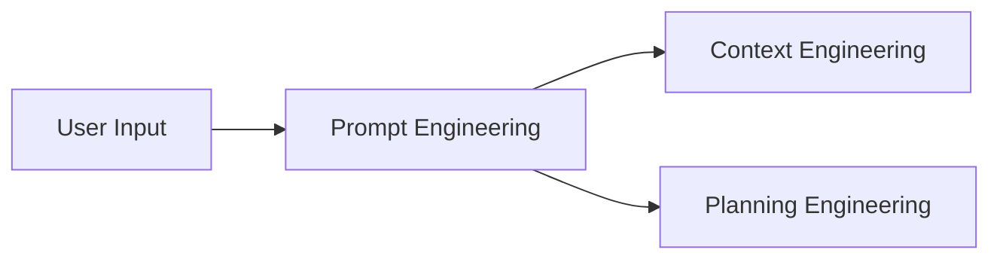
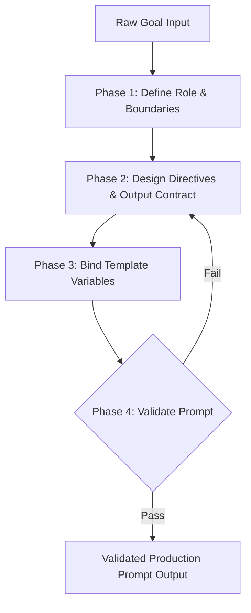

# Prompt Engineering Workflow (`/prompt-engineering`)

---

## Overview

### Purpose
The **Prompt Engineering Workflow** is responsible for designing, structuring, validating, and optimizing agent instructions and output contracts. It converts raw, ambiguous user intentions into well-formatted, deterministic prompt specifications that downstream workflows can execute reliably.

### Responsibilities
* Persona & Role Definition: Establishing strict agent behaviors and domain expertise.
* Output Contract Engineering: Defining machine-readable JSON/Markdown response schemas.
* Reusable Prompt Templates: Managing modular template placeholders (`{{VARIABLE}}`).
* Prompt Validation & Verification: Pre-checking prompt clarity, completeness, and safety constraints.
* Prompt Optimization: Iteratively refining prompts based on execution feedback.

### When to Use
* Before launching complex autonomous multi-step operations.
* When defining new agent capabilities, workflows, or slash-commands.
* When agent outputs fail downstream parsing or exhibit non-deterministic behavior.

### When NOT to Use
* For trivial one-liner commands or direct user questions that require immediate answers.
* For actual code implementation, testing, or git operations (delegate to downstream workflows).

---

## Inputs

| Input Parameter | Type | Required | Description |
|:---|:---|:---:|:---|
| `RawGoal` | String | Yes | Raw user request or high-level feature goal |
| `TargetRole` | String | No | Specialized agent role (e.g., Security Auditor, Frontend Engineer) |
| `OutputContractSchema` | Object | No | Expected JSON/Markdown response structure |
| `ContextVariables` | Dictionary | No | Key-value pairs for prompt template placeholders |
| `SafetyConstraints` | Array | No | Specific constraints or guardrails to enforce in the prompt |

---

## Outputs

| Output Parameter | Format | Description |
|:---|:---|:---|
| `ValidatedPrompt` | Markdown / Text | Structured, production-ready system/user prompt |
| `OutputSchemaDefinition` | JSON Schema / Markdown | Machine-readable contract for expected output |
| `TemplateVariableMap` | JSON | Validated variable bindings used in prompt |
| `PromptValidationReport` | Markdown | Completeness and ambiguity assessment report |

---

## Dependencies

* **Upstream**: User Request, System Capabilities Specification
* **Downstream**: Context Engineering (loads context based on prompt directives), Planning Engineering (uses prompt contract to generate roadmaps)

---

## Internal Phases

### Phase 1: Persona & Role Definition
* **Objective**: Establish precise domain identity, capabilities, and system boundaries.
* **Actions**:
  1. Define system role, experience level, and operational domain.
  2. Specify communication language and tone rules.
  3. Set boundary conditions (what the agent MUST and MUST NOT do).
* **Success Criteria**: Clear role statement with explicit constraints.

### Phase 2: Instruction & Output Contract Design
* **Objective**: Structure deterministic execution steps and response formats.
* **Actions**:
  1. Translate goals into unambiguous, step-by-step imperative directives.
  2. Define strict output contracts (e.g., Markdown template, JSON schema).
  3. Include error reporting formats for failure handling.
* **Success Criteria**: Machine-parsable output schema definition.

### Phase 3: Template & Placeholder Binding
* **Objective**: Parameterize instructions for vendor-neutral portability.
* **Actions**:
  1. Replace project-specific commands with template variables (`{{TEST_COMMAND}}`, etc.).
  2. Bind template variables using `.agent/shared/project-config.md`.
* **Success Criteria**: Fully bound prompt free of unresolved placeholders.

### Phase 4: Prompt Validation & Dry Run
* **Objective**: Verify prompt against quality criteria before execution.
* **Actions**:
  1. Validate against completeness checklist (No missing context, no ambiguous terms).
  2. Check for security/safety constraint inclusion.
* **Success Criteria**: Pass 100% of prompt validation checks.

---

## Execution Rules

1. **Explicit Schema Enforcement**: Every generated prompt MUST specify an exact output format contract.
2. **No Ambiguous Instructions**: Directives MUST use clear, actionable verbs (e.g., "Extract...", "Validate...", "Generate...").
3. **Template Neutrality**: Prompts MUST use template placeholders (`{{...}}`) for environment-dependent commands.
4. **Zero Assumptions**: Prompts MUST explicitly state default fallback behaviors when inputs are missing.

---

## Guardrails

* **Constraint Check**: Ensure prompt explicitly includes branch protection (`NEVER push to main`) and retry limits (`max 3 retries`).
* **Path Sanitization Directive**: Prompt MUST instruct the agent to use project-relative paths.
* **Secret Leakage Prevention**: System prompts MUST instruct the agent to mask credentials.

---

## Best Practices

* Use clear markdown section headers (`#`, `##`, `###`) to separate instructions, examples, and rules.
* Provide positive and negative examples (Few-shot prompting) for complex output contracts.
* Keep system prompts under 500 lines; move extensive reference data to external docs.

---

## Anti-Patterns

* ❌ **Vague Goals**: "Improve the code quality" (Use: "Refactor functions over 50 lines into modular helpers").
* ❌ **Unstructured Outputs**: Asking for conversational text without a structured template or schema.
* ❌ **Hardcoded Machine Paths**: Including `C:\Users\...` in prompt templates.

---

## Mermaid Diagram

---

## Integration Points

* **Context Engineering**: Receives `ValidatedPrompt` to determine which repository files and memory artifacts to load.
* **Planning Engineering**: Uses `OutputSchemaDefinition` to format milestone roadmaps.
* **Loop Engineering**: Executes prompts within the iterative loop.

---

## Extensibility

* **Custom Prompt Modules**: Future agents can extend this workflow by adding specialized domain templates (e.g., Security Audit Prompt Module, Performance Optimization Prompt Module) in subdirectories.
