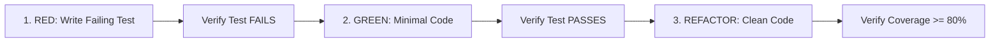

# Test-Driven Development Workflow (`/tdd`)

Enforces Test-Driven Development (TDD) methodology. This workflow delegates test execution to [Harness Engineering](./harness-engineering.md) and uses abstract commands from [project-config.md](../shared/project-config.md).

---

## 🛡️ Guardrails & Safety Rules (STRICTLY ENFORCED)

> [!CAUTION]
> **NEVER skip the RED phase**. Implementation code written before tests fail will be rejected.

> [!CAUTION]
> **Circuit Breaker**: If a test fails to pass after **3 consecutive implementation attempts**, HALT execution, revert to last checkpoint (`git checkout -- .`), and request human intervention.

> [!IMPORTANT]
> **Branch Gate**: Ensure you are on a dedicated feature branch (`feat/*`, `fix/*`) before writing code or tests.

---

## TDD Cycle Phases

---

## Execution Steps

1. **Scaffold Interfaces / Types**: Define TypeScript input/output contracts.
2. **Write Failing Test (RED)**: Write unit/integration test describing expected behavior.
3. **Verify Failure**: Run test command (`{{TEST_COMMAND}}` -> `cd web && npx vitest run`) and verify it **FAILS**.
4. **Minimal Implementation (GREEN)**: Write ONLY enough production code to make the test pass.
5. **Verify Pass**: Run `{{TEST_COMMAND}}` and verify it **PASSES**.
6. **Refactor**: Clean code, improve names, ensure immutability while keeping tests green.
7. **Verify Coverage**: Run `{{TEST_COVERAGE_COMMAND}}` (`cd web && npx vitest run --coverage`).
   - Standard code: **80%+ minimum coverage**.
   - Authentication / Security logic: **100% required coverage**.

---

## Coverage Requirements & Thresholds

- Standard components/utilities: `{{COVERAGE_THRESHOLD}}`% (`80%`) minimum.
- Authentication & security logic: `{{CRITICAL_COVERAGE_THRESHOLD}}`% (`100%`) required.
