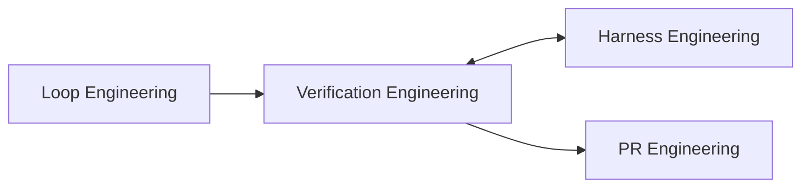
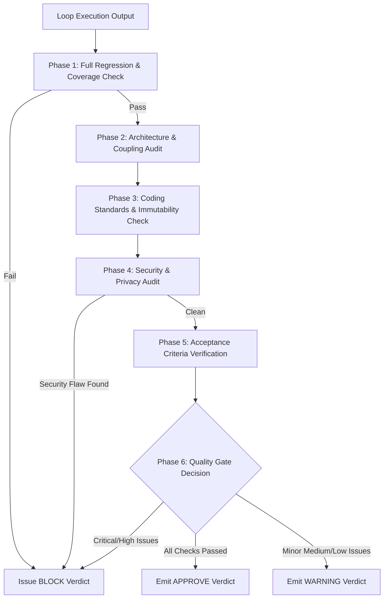

# Verification Engineering Workflow (`/verification-engineering`)

---

## Overview

### Purpose
The **Verification Engineering Workflow** acts as the final automated quality gate before code changes are packaged into Pull Requests. It performs comprehensive static analysis, architectural compliance checks, security audits, performance evaluations, and regression testing to ensure high software quality and prevent security flaws or technical debt from entering the repository.

### Responsibilities
* Full Regression Verification: Invoking Harness Engineering to run complete test suites and coverage reports.
* Architecture & Coupling Review: Checking file length (< 800 lines), function length (< 50 lines), and nesting depth (< 4 levels).
* Coding Standards Compliance: Enforcing immutability, error handling, and type safety rules.
* Security Vulnerability Audit: Scanning for hardcoded secrets, XSS, injection, CSRF, and path leaks.
* Quality Gate Decisioning: Issuing formal verdict (APPROVE, WARNING, or BLOCK).

### When to Use
* Upon completion of Loop Engineering before invoking PR Engineering.
* During automated pre-PR code review workflows (`/code-review`).

### When NOT to Use
* For generating initial implementation code (delegate to Loop Engineering).
* For creating pull requests directly (delegate to PR Engineering).

---

## Inputs

| Input Parameter | Type | Required | Description |
|:---|:---|:---:|:---|
| `LoopExecutionReport` | Object | Yes | Summary of completed tasks and modified files from Loop Engineering |
| `AcceptanceCriteria` | Array | Yes | Target criteria to verify against implementation |
| `SecurityPolicies` | Array | No | Specific security requirements (`.agent/rules/security.md`) |
| `QualityThresholds` | Dictionary | No | Custom coverage or quality thresholds |

---

## Outputs

| Output Parameter | Format | Description |
|:---|:---|:---|
| `QualityGateVerdict` | Enum | Final decision: `APPROVE`, `WARNING`, or `BLOCK` |
| `VerificationReport` | Markdown | Comprehensive evaluation report categorizing issues by severity |
| `SecurityAuditReport` | JSON | Findings for hardcoded secrets, injection, XSS, and authorization |
| `RegressionTestSummary` | JSON | Full suite test execution and coverage percentage results |

---

## Dependencies

* **Upstream**: Loop Engineering (supplies completed code and checkpoints)
* **Downstream**: Harness Engineering (invoked for full test/coverage execution), PR Engineering (receives quality gate verdict)

---

## Internal Phases

### Phase 1: Full Suite Test & Regression Validation
* **Objective**: Ensure no existing functionality was broken by changes.
* **Actions**:
  1. Invoke Harness Engineering (`TargetChecks: ["test", "coverage", "typecheck"]`).
  2. Verify overall coverage meets `{{COVERAGE_THRESHOLD}}`% (100% for security/auth logic).
* **Success Criteria**: 100% test pass rate; coverage meets or exceeds threshold.

### Phase 2: Architecture & File Coupling Audit
* **Objective**: Maintain clean codebase architecture and prevent monolith files.
* **Actions**:
  1. Check function line counts (`<= 50 lines`).
  2. Check file line counts (`<= 800 lines`).
  3. Check nesting levels (`<= 4 levels`).
* **Success Criteria**: Zero architectural structural violations.

### Phase 3: Coding Standards & Immutability Check
* **Objective**: Enforce project coding style rules (`.agent/rules/coding-style.md`).
* **Actions**:
  1. Verify immutable data patterns (no direct object mutation).
  2. Verify comprehensive error handling (no empty `catch` blocks or swallowed errors).
  3. Check for leftover `console.log` or debug statements.
* **Success Criteria**: 100% compliance with coding style checklist.

### Phase 4: Security & Privacy Audit (CRITICAL)
* **Objective**: Guarantee zero security vulnerabilities or privacy breaches.
* **Actions**:
  1. Scan diffs for hardcoded credentials, API keys, or Cognito secrets.
  2. Verify path sanitization (no absolute local paths like `C:\Users\...`).
  3. Check XSS, SQL/NoSQL injection, and CSRF prevention patterns.
* **Success Criteria**: **ZERO** CRITICAL or HIGH security findings.

### Phase 5: Acceptance Criteria Verification
* **Objective**: Confirm implementation satisfies 100% of original goals.
* **Actions**:
  1. Map verified behaviors against `AcceptanceCriteria` defined during Planning.
* **Success Criteria**: All acceptance criteria marked verified.

### Phase 6: Quality Gate Decisioning
* **Objective**: Issue definitive merge readiness decision.
* **Decision Rules**:
  - **APPROVE**: Zero CRITICAL/HIGH findings; tests pass; coverage meets threshold.
  - **WARNING**: Only MEDIUM/LOW findings (e.g., minor stylistic issues).
  - **BLOCK**: Any CRITICAL or HIGH finding, failing test, or type error.
* **Success Criteria**: Formal verdict emitted in `QualityGateVerdict`.

---

## Execution Rules

1. **Zero Tolerance for Security Flaws**: Any CRITICAL or HIGH security finding MUST automatically issue a `BLOCK` verdict.
2. **Confidence-Based Filtering**: Only flag issues with > 80% confidence of being true defects to minimize noise.
3. **Un-truncated Error Analysis**: Never pass a quality gate without inspecting full traceback evidence.
4. **Independent Audit**: Verification Engineering MUST evaluate code independently without relying on agent self-claims.

---

## Guardrails

* **Merge Blocker**: If verdict is `BLOCK`, PR creation MUST be halted.
* **Absolute Path Sanitization**: Automatically fail verification if local machine paths are detected in modified files.

---

## Best Practices

* Categorize findings clearly by severity: `[CRITICAL]`, `[HIGH]`, `[MEDIUM]`, `[LOW]`.
* Provide precise file location, line numbers, and actionable code fixes for every reported issue.

---

## Anti-Patterns

* ❌ **Approving Vulnerabilities**: Passing code with exposed API keys because "it works".
* ❌ **Pedantic Noise**: Flagging minor formatting preferences when code passes prettier checks.
* ❌ **Ignoring Coverage Drop**: Approving PRs where code coverage dropped significantly below threshold.

---

## Mermaid Diagram

---

## Integration Points

* **Loop Engineering**: Receives code changes from loop completion.
* **Harness Engineering**: Invoked to run full test suites, coverage checks, and linters.
* **PR Engineering**: Receives `QualityGateVerdict` to determine whether PR can be opened.

---

## Extensibility

* **Automated Static Analysis Integration**: Phase 4 can be extended to query SonarQube, Snyk, or CodeQL APIs for enterprise security scanning.
