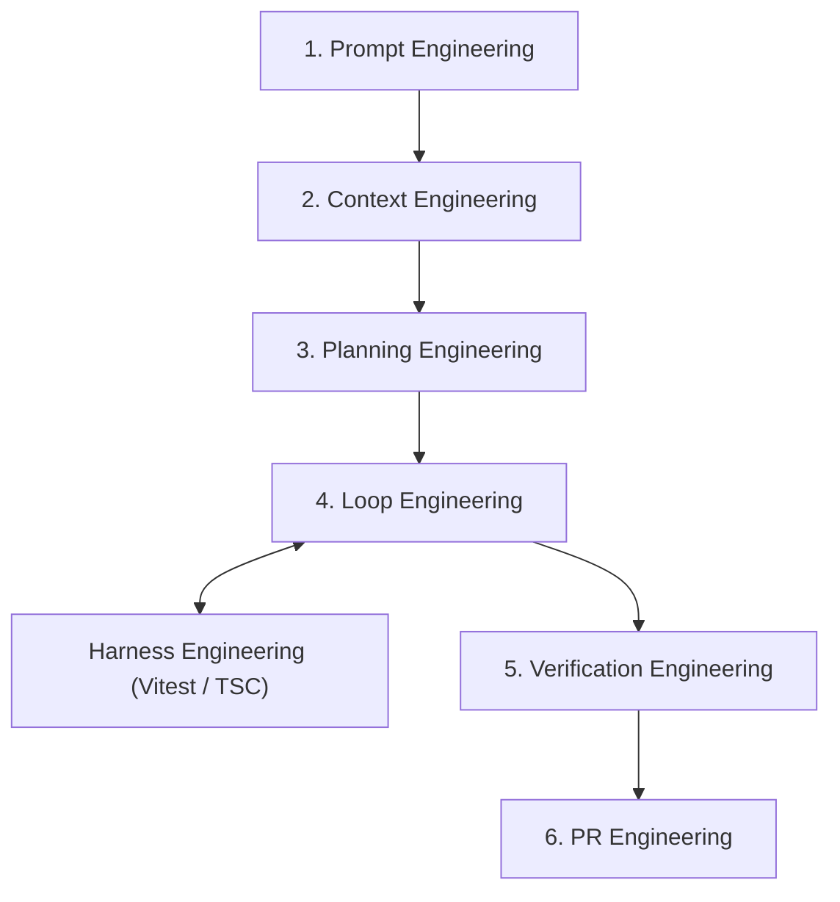

# AI-Native Development Guidelines

This document outlines the rules of engagement and best practices for developing the **My Roadmap** project using AI coding assistants. The goal is to maximize productivity while strictly preventing the accumulation of technical debt, architectural drift, and "black box" code.

---

## 1. Core Principles: Preventing "AI Sprawl"

AI assistants are powerful but prone to over-engineering or hallucinating complex solutions when given overly broad prompts. We mitigate this through **strict control and verification**.

### 1.1 Small Chunking (Granular Micro-Tasks)
- **Rule**: Never ask the AI to build an entire feature (e.g., "Build the dashboard") in a single prompt.
- **Action**: Break down features into explicit, atomic micro-tasks (Size **XS** `< 1h` or **S** `1-2h`).
- **Execution**: Instruct the AI to focus *only* on the current micro-task. One Pull Request (PR) must equal one specific objective.

### 1.2 Test-Driven AI (TDAI)
- **Rule**: Define the expected behavior before writing the implementation.
- **Action**: For complex logic, ask the AI to write the unit tests (Vitest) or validation schemas (Zod) *first*.
- **Execution**: Review and approve the tests. Only then, instruct the AI to write the minimum code required to pass those tests.

### 1.3 Critical Review & The "Explain It" Rule
- **Rule**: Never blindly accept code you do not fully understand.
- **Action**: If the AI proposes a complex architecture, an unfamiliar library, or a dense block of code, halt the implementation.
- **Execution**: Demand an explanation: "Explain this code line-by-line", or request a refactor: "Rewrite this using a simpler, more maintainable approach (KISS principle)."

---

## 2. Infrastructure as the Quality Gate (CI/CD)

We rely on automated systems to catch AI errors that human review might miss.

### 2.1 Strict Linting and Typing
- The AI must adhere strictly to ESLint configurations and TypeScript's `strict: true` mode.
- Use of `any` or `@ts-ignore` is strictly prohibited unless explicitly authorized with a documented reason.

### 2.2 CI/CD Enforcement
- All AI-generated PRs must pass the GitHub Actions CI pipeline (Typecheck, Lint, Tests).
- If the CI fails, feed the error logs back to the AI for step-by-step debugging. The AI must fix the root cause, not apply a temporary patch.

---

## 3. Context Management and Prompt Engineering

The quality of AI output is directly proportional to the context provided.

### 3.1 The "Context Rule"
- **Rule**: The AI must always refer to `docs/requirements.md`, `project-context.md`, and this `ai_development_guidelines.md` before starting a new task.
- **Action**: Ensure the AI is explicitly aware of the Tech Stack (Next.js App Router, Tailwind, Amplify Gen 2, etc.) and avoids deviating into older paradigms (e.g., React Class Components or Pages Router).

### 3.2 Implementation Plans
- **Rule**: Code must not be written without a plan.
- **Action**: The AI must output a detailed, step-by-step `implementation_plan.md` for the current task and **wait for explicit user approval** before executing any file modifications.

---

## 4. Continuous Refactoring

AI code can become disjointed over multiple sessions.
- **Rule**: Refactor early and often.
- **Action**: After completing a major feature, dedicate a session solely to cleaning up the code, extracting reusable components (shadcn/ui), and consolidating duplicated logic. Do not add new features during a refactoring session.

---

## 5. Autonomous AI Engineering System & Loop Architecture

To support systematic, agent-first execution, the repository implements a modular **AI Engineering Operating System** comprising 7 composable workflow modules located under `.agent/workflows/`.

### 5.1 The Autonomous Loop Execution Framework (`/loop-engineering`)

The core execution engine operates autonomously in iterative, step-by-step micro-task cycles:

1. **Phase 1: Task Queue & Scope Pre-Check**:
   - Decomposes goals into XS/S micro-tasks via **Planning Engineering**.
   - Checks destructive operations: Actions requiring major directory deletion or DB resets trigger a mandatory **Approval Hook**.
2. **Phase 2: Iterative TDD Loop (RED → GREEN → REFACTOR)**:
   - **RED**: Writes failing unit/component tests in Vitest.
   - **GREEN**: Implements minimal production code to pass the test.
   - **REFACTOR**: Cleans code and verifies zero regression via **Harness Engineering**.
3. **Phase 3: Dual Circuit Breaker & Safety Policies**:
   - **Task-Level Limit**: Maximum **3 consecutive retries** for the same error on a single micro-task.
   - **Cumulative Loop Limit**: Maximum **5 cumulative retries** across an entire loop session.
   - **Circuit Breaker Action**: Exceeding retry limits halts execution immediately, reverts to the last git checkpoint (`git checkout -- .`), and alerts the human developer.
4. **Phase 4: Token & Cost Guardrails**:
   - **Micro-Task Scope Limit**: Maximum **3 files modified** and **< 200 lines changed** per task.
   - **Run Execution Limit**: Maximum **5 micro-tasks** per single loop invocation.
   - **Targeted Context Refresh**: Context Engineering re-reads only modified files to conserve token budget.
5. **Phase 5: Quality Gate & Handover**:
   - **Verification Engineering** audits code for zero security defects, path sanitization (relative paths only), and 80%+ test coverage.
   - **PR Engineering** formats Conventional Commit summaries, collates test evidence, and opens a Pull Request (`gh pr create`).

---

## Appendix: Communication Protocol (Hybrid)

- Deep dives, logic discussions, and complex planning: **Japanese**
- Source code variables, function names, inline comments, commit messages (Conventional Commits), PR descriptions: **English**
