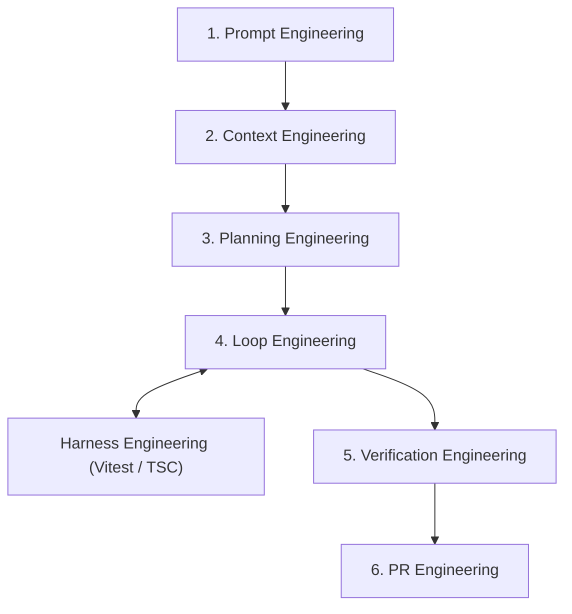

# AIネイティブ開発ガイドライン (AI-Native Development Guidelines)

本ドキュメントは、AIコーディングアシスタントを活用して **My Roadmap** プロジェクトを開発する際のルールおよびベストプラクティスを定義します。目的は、生産性を最大化しつつ、技術負債、アーキテクチャのドリフト（逸脱）、およびブラックボックスコードの蓄積を厳格に防止することです。

---

## 1. コア原則: 「AI暴走・肥大化」の防止

AIアシスタントは非常に強力ですが、あいまいまたは範囲の広すぎるプロンプトが与えられると、オーバーエンジニアリングや存在しないソリューションのハルシネーション（幻想）を引き起こす傾向があります。私たちは **厳格なコントロールと自動検証** によりこれを防ぎます。

### 1.1 マイクロタスク化 (Granular Micro-Tasks)
- **ルール**: 「ダッシュボードを作成して」といった機能全体の構築を 1 つのプロンプトで要求しないこと。
- **アクション**: 機能を明確かつアトミックなマイクロタスク (サイズ **XS** `< 1h` または **S** `1-2h`) に分解する。
- **実行**: AIに対し、現在のマイクロタスク *のみ* に集中するよう指示する。1つの Pull Request (PR) は 1つの明確な目的に対応させる。

### 1.2 テスト駆動AI開発 (Test-Driven AI / TDAI)
- **ルール**: 実装コードを書く前に期待される動作を定義する。
- **アクション**: 複雑なロジックについては、AIに単体テスト (Vitest) またはバリデーションスキーマ (Zod) を *最初に* 書かせる。
- **実行**: テストコードを人間がレビューし承認する。その後にのみ、テストを通過させるための最小限の実装コードを書かせる。

### 1.3 批判的レビューと「説明義務」ルール
- **ルール**: 自分が完全に理解していないコードを盲目的に受け入れないこと。
- **アクション**: AIが複雑なアーキテクチャ、見慣れないライブラリ、密なコードブロックを提案した場合は実行を中断する。
- **実行**: 説明を要求する ("このコードを1行ずつ説明してください")。またはリファクタリングを指示する ("KISS原則に従い、よりシンプルで保守しやすいアプローチで書き直してください")。

---

## 2. 品質ゲートとしてのインフラストラクチャ (CI/CD)

人間のレビューで見落とされる可能性のあるAIのエラーを捕らえるため、自動化システムに依存します。

### 2.1 厳格なリンティングと型定義
- AIは ESLint 設定および TypeScript の `strict: true` モードに厳格に従わなければならない。
- `any` や `@ts-ignore` の使用は、文書化された正当な理由で明示的に認可されない限り厳禁。

### 2.2 CI/CD による強制
- AIが生成したすべての PR は、GitHub Actions CI パイプライン (Typecheck, Lint, Tests) を通過しなければならない。
- CI が失敗した場合、エラーログを AI にフィードバックしてステップバイステップでデバッグさせる。AIは不快な症状の隠蔽ではなく根本原因を修正しなければならない。

---

## 3. コンテキスト管理とプロンプトエンジニアリング

AIの出力品質は、提供されるコンテキストの精度に直結します。

### 3.1 「コンテキストルール」
- **ルール**: AIは新しいタスクを開始する前に、必ず `docs/requirements.md`、`project-context.md`、および本 `ai_development_guidelines.md` を参照しなければならない。
- **アクション**: AIが技術スタック (Next.js App Router, Tailwind, Amplify Gen 2 等) を正確に認識し、古いパターンのコードを出力しないよう徹底する。

### 3.2 実装計画 (Implementation Plans)
- **ルール**: 計画なしにコードを書いてはならない。
- **アクション**: AIは現在のタスクに対する詳細なステップバイステップの `implementation_plan.md` を出力し、ファイル修正を実行する前に **人間の明示的な承認を待たなければならない**。

---

## 4. 継続的リファクタリング (Continuous Refactoring)

AIが作成したコードは、複数のセッションにまたがると断片化する可能性があります。
- **ルール**: 早期かつ高頻度でリファクタリングを行う。
- **アクション**: 主要機能を完了した後は、コードのクリーンアップ、再利用可能コンポーネント (shadcn/ui) の抽出、重複ロジックの統合専用セッションを設ける。リファクタリングセッション中に新機能を追加してはならない。

---

## 5. 自律型AIエンジニアリングシステム & ループアーキテクチャ

系統的でエージェントファーストな実行をサポートするため、本リポジトリには `.agent/workflows/` 下に 7 つのコンポーザブルな **AI Engineering OS** ワークフローモジュールが組み込まれています。

### 5.1 自律型ループ実行フレームワーク (`/loop-engineering`)

中核となる実行エンジンは、ステップバイステップのマイクロタスクサイクルで自律的に動作します：

1. **Phase 1: タスクキュー & スコープ事前チェック**:
   - **Planning Engineering** 経由で目標を XS/S サイズのマイクロタスクに分解。
   - 破壊的操作の確認: 大規模なディレクトリ削除や DB リセットを必要とするアクションは、義務的な **Approval Hook** を起動。
2. **Phase 2: イテレーティブ TDD ループ (RED → GREEN → REFACTOR)**:
   - **RED**: Vitest で失敗するテストを書く。
   - **GREEN**: テストをパスする最小限のプロダクションコードを実装。
   - **REFACTOR**: コードを整理し、**Harness Engineering** 経由でデグレがないことを確認。
3. **Phase 3: 二重サーキットブレーカー & 安全ポリシー**:
   - **タスクレベル上限**: 同一エラーでのリトライは最大 **3回**。
   - **累積ループ上限**: 1セッション全体の累積リトライは最大 **5回**。
   - **動作**: 限界値を超えた場合は直ちに実行を停止 (HALT) し、直前のチェックポイントにロールバック (`git checkout -- .`) して人間へアラートを送信。
4. **Phase 4: トークン & コスト保護ガードレール**:
   - **マイクロタスクスコープ上限**: 1タスクあたり最大 **3ファイル変更** および **< 200行差分**。
   - **連続実行上限**: 1回のループ呼び出しあたり最大 **5マイクロタスク**。
   - **ターゲット限定 Context Refresh**: トークン予算を節約するため、変更されたファイルのみをメモリ再読み込み。
5. **Phase 5: 品質ゲート & 引き渡し**:
   - **Verification Engineering** がセキュリティ上の欠陥ゼロ、相対パスの徹底、カバレッジ 80%+ を監査。
   - **PR Engineering** が Conventional Commit サマリーを整え、テスト証拠をまとめた上で Pull Request を作成 (`gh pr create`)。

---

## 付録: コミュニケーションプロトコル (ハイブリッド仕様)

- 要件検討、ロジック議論、詳細プロンプト設計: **日本語**
- ソースコード変数、関数名、インラインコメント、コミットメッセージ (Conventional Commits), PR本文: **英語**

# AI-Native Development Guidelines

This document outlines the rules of engagement and best practices for developing the **My Roadmap** project using AI coding assistants. The goal is to maximize productivity while strictly preventing the accumulation of technical debt, architectural drift, and "black box" code.

---

## 1. Core Principles: Preventing "AI Sprawl"

AI assistants are powerful but prone to over-engineering or hallucinating complex solutions when given overly broad prompts. We mitigate this through **strict control and verification**.

### 1.1 Small Chunking (Granular Micro-Tasks)
- **Rule**: Never ask the AI to build an entire feature (e.g., "Build the dashboard") in a single prompt.
- **Action**: Break down features into explicit, atomic micro-tasks (Size **XS** `< 1h` or **S** `1-2h`).
- **Execution**: Instruct the AI to focus *only* on the current micro-task. One Pull Request (PR) must equal one specific objective.

### 1.2 Test-Driven AI (TDAI)
- **Rule**: Define the expected behavior before writing the implementation.
- **Action**: For complex logic, ask the AI to write the unit tests (Vitest) or validation schemas (Zod) *first*.
- **Execution**: Review and approve the tests. Only then, instruct the AI to write the minimum code required to pass those tests.

### 1.3 Critical Review & The "Explain It" Rule
- **Rule**: Never blindly accept code you do not fully understand.
- **Action**: If the AI proposes a complex architecture, an unfamiliar library, or a dense block of code, halt the implementation.
- **Execution**: Demand an explanation: "Explain this code line-by-line", or request a refactor: "Rewrite this using a simpler, more maintainable approach (KISS principle)."

---

## 2. Infrastructure as the Quality Gate (CI/CD)

We rely on automated systems to catch AI errors that human review might miss.

### 2.1 Strict Linting and Typing
- The AI must adhere strictly to ESLint configurations and TypeScript's `strict: true` mode.
- Use of `any` or `@ts-ignore` is strictly prohibited unless explicitly authorized with a documented reason.

### 2.2 CI/CD Enforcement
- All AI-generated PRs must pass the GitHub Actions CI pipeline (Typecheck, Lint, Tests).
- If the CI fails, feed the error logs back to the AI for step-by-step debugging. The AI must fix the root cause, not apply a temporary patch.

---

## 3. Context Management and Prompt Engineering

The quality of AI output is directly proportional to the context provided.

### 3.1 The "Context Rule"
- **Rule**: The AI must always refer to `docs/requirements.md`, `project-context.md`, and this `ai_development_guidelines.md` before starting a new task.
- **Action**: Ensure the AI is explicitly aware of the Tech Stack (Next.js App Router, Tailwind, Amplify Gen 2, etc.) and avoids deviating into older paradigms (e.g., React Class Components or Pages Router).

### 3.2 Implementation Plans
- **Rule**: Code must not be written without a plan.
- **Action**: The AI must output a detailed, step-by-step `implementation_plan.md` for the current task and **wait for explicit user approval** before executing any file modifications.

---

## 4. Continuous Refactoring

AI code can become disjointed over multiple sessions.
- **Rule**: Refactor early and often.
- **Action**: After completing a major feature, dedicate a session solely to cleaning up the code, extracting reusable components (shadcn/ui), and consolidating duplicated logic. Do not add new features during a refactoring session.

---

## 5. Autonomous AI Engineering System & Loop Architecture

To support systematic, agent-first execution, the repository implements a modular **AI Engineering Operating System** comprising 7 composable workflow modules located under `.agent/workflows/`.

### 5.1 The Autonomous Loop Execution Framework (`/loop-engineering`)

The core execution engine operates autonomously in iterative, step-by-step micro-task cycles:

1. **Phase 1: Task Queue & Scope Pre-Check**:
   - Decomposes goals into XS/S micro-tasks via **Planning Engineering**.
   - Checks destructive operations: Actions requiring major directory deletion or DB resets trigger a mandatory **Approval Hook**.
2. **Phase 2: Iterative TDD Loop (RED → GREEN → REFACTOR)**:
   - **RED**: Writes failing unit/component tests in Vitest.
   - **GREEN**: Implements minimal production code to pass the test.
   - **REFACTOR**: Cleans code and verifies zero regression via **Harness Engineering**.
3. **Phase 3: Dual Circuit Breaker & Safety Policies**:
   - **Task-Level Limit**: Maximum **3 consecutive retries** for the same error on a single micro-task.
   - **Cumulative Loop Limit**: Maximum **5 cumulative retries** across an entire loop session.
   - **Circuit Breaker Action**: Exceeding retry limits halts execution immediately, reverts to the last git checkpoint (`git checkout -- .`), and alerts the human developer.
4. **Phase 4: Token & Cost Guardrails**:
   - **Micro-Task Scope Limit**: Maximum **3 files modified** and **< 200 lines changed** per task.
   - **Run Execution Limit**: Maximum **5 micro-tasks** per single loop invocation.
   - **Targeted Context Refresh**: Context Engineering re-reads only modified files to conserve token budget.
5. **Phase 5: Quality Gate & Handover**:
   - **Verification Engineering** audits code for zero security defects, path sanitization (relative paths only), and 80%+ test coverage.
   - **PR Engineering** formats Conventional Commit summaries, collates test evidence, and opens a Pull Request (`gh pr create`).

---

## Appendix: Communication Protocol (Hybrid)

- Deep dives, logic discussions, and complex planning: **Japanese**
- Source code variables, function names, inline comments, commit messages (Conventional Commits), PR descriptions: **English**

