# AI Agent Task Decomposition — Design Document (Prototype)

> [!NOTE]
> This document describes the **prototype design** for the AI-powered task decomposition feature.
> Requirements are **not finalized** — this design is intentionally flexible for iteration.

## 1. Overview

### 1.1 Objective

Add an AI agent capability to the existing task management app ("My Roadmap") that automatically decomposes a high-level task (epic) into actionable subtasks.

**User Experience Goal**: "I typed one big task, and the AI created detailed subtasks for me in real time."

### 1.2 Design Philosophy

| Principle | Description |
|---|---|
| **Harness over Model Intelligence** | Use a cost-effective model (e.g., Claude Haiku 4.5) and compensate with strict harness design — prompt engineering, validation, and execution control |
| **Model Agnostic** | The system MUST support swapping between Claude, Gemini, and ChatGPT with a single configuration change |
| **Architectural Isolation** | The AI service is fully decoupled from the existing Amplify-managed backend. Communication happens only through a dedicated API Gateway |
| **Progressive Enhancement** | The AI feature enhances the existing task flow; the app remains fully functional without it |

### 1.3 Scope

#### In Scope

- Natural language epic input with AI-powered subtask decomposition
- Structured output via Tool Use / Function Calling
- Real-time streaming of generated subtasks to the frontend (SSE)
- Draft → Review → Confirm workflow for generated subtasks
- Retry and partial-failure recovery
- Model-agnostic adapter pattern

#### Out of Scope (Future)

- Auto-sorting / grouping of existing tasks
- Proactive AI interventions (event-driven)
- Multi-turn conversational refinement (v2+)
- External tool integrations (calendar, Slack, etc.)

---

## 2. System Architecture

### 2.1 High-Level Architecture

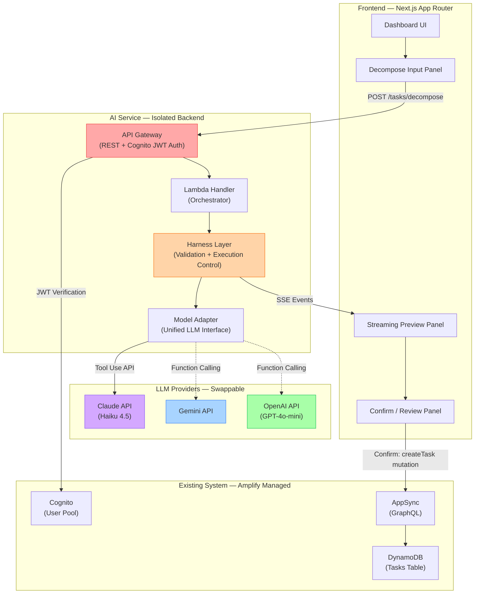

### 2.2 Data Flow Sequence

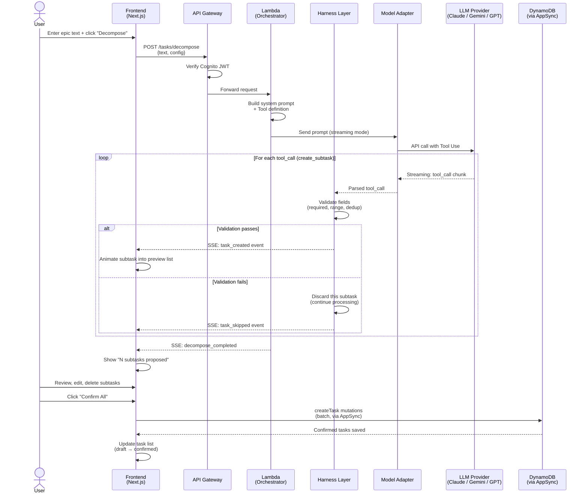

---

## 3. Model-Agnostic Adapter Design

### 3.1 Adapter Pattern

The LLM client uses the **Adapter Pattern** to normalize different provider APIs into a single interface. Model switching requires only a configuration change — no code changes.

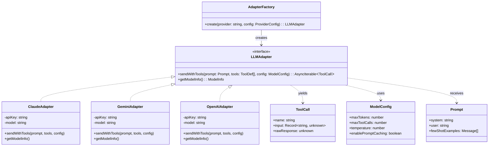

### 3.2 Provider Capability Matrix

| Capability | Claude (Haiku 4.5) | Gemini (Flash 2.0) | OpenAI (GPT-4o-mini) |
|---|---|---|---|
| Tool Use / Function Calling | ✅ Native | ✅ Native | ✅ Native |
| Streaming with Tool Use | ✅ | ✅ | ✅ |
| Prompt Caching | ✅ (significant discount) | ✅ (context caching) | ❌ |
| Structured Output | Via Tool Use | Via JSON mode | Via Structured Outputs |
| Cost (Input / Output per MTok) | ~$1 / $5 | ~$0.10 / $0.40 | ~$0.15 / $0.60 |

> [!TIP]
> The default model is **Claude Haiku 4.5** for its strong Tool Use compliance.
> Gemini Flash 2.0 offers the lowest cost and is a strong candidate for cost-sensitive deployments.
> The adapter pattern allows switching with zero code changes.

### 3.3 Configuration Schema

```typescript
// ai-service/config/model-config.ts
interface AIServiceConfig {
  readonly provider: 'claude' | 'gemini' | 'openai';
  readonly model: string;
  readonly maxTokens: number;
  readonly maxToolCalls: number;     // Hard limit: 15
  readonly temperature: number;       // Low for deterministic output: 0.2
  readonly enablePromptCaching: boolean;
  readonly costLimits: {
    readonly maxInputTokensPerRequest: number;
    readonly maxOutputTokensPerRequest: number;
  };
}

// Example: default configuration
const DEFAULT_CONFIG: AIServiceConfig = {
  provider: 'claude',
  model: 'claude-haiku-4-5-20241022',
  maxTokens: 4096,
  maxToolCalls: 15,
  temperature: 0.2,
  enablePromptCaching: true,
  costLimits: {
    maxInputTokensPerRequest: 8000,
    maxOutputTokensPerRequest: 4000,
  },
};
```

---

## 4. Harness Design (Core Quality Layer)

The harness is the **most critical component** — it ensures output quality regardless of model capability.

### 4.1 Harness Architecture

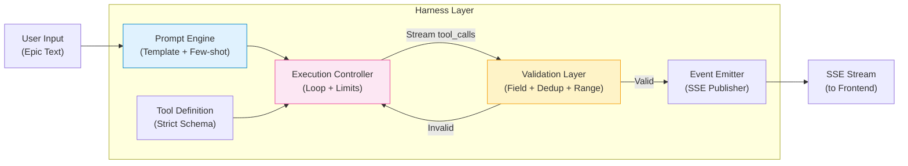

### 4.2 Prompt Design Strategy

```
┌─────────────────────────────────────────────────────┐
│                 SYSTEM PROMPT (Cached)               │
│                                                      │
│  Role: Expert task decomposition specialist          │
│  Rules:                                              │
│    - Output ONLY via create_subtask tool calls       │
│    - Each subtask: 0.5–3 days of work               │
│    - Generate 5–12 subtasks per epic                 │
│    - Use logical execution order                     │
│    - Never generate free-form text                   │
│                                                      │
│  Few-Shot Examples (1–2):                            │
│    Input: "Build a REST API for user management"     │
│    → create_subtask("Design API schema", ...)        │
│    → create_subtask("Set up project scaffold", ...)  │
│    → create_subtask("Implement auth endpoints", ...) │
│    → ...                                             │
│                                                      │
│  ─ ─ ─ ─ ─ ─ Prompt Cache Boundary ─ ─ ─ ─ ─ ─ ─   │
├─────────────────────────────────────────────────────┤
│                  USER MESSAGE (Dynamic)              │
│                                                      │
│  "Decompose this task: {user_epic_text}"             │
│                                                      │
└─────────────────────────────────────────────────────┘
```

> [!IMPORTANT]
> The system prompt and few-shot examples are **fixed per deployment** and designed for prompt caching.
> Only the user message changes per request, minimizing input token costs.

### 4.3 Tool Definition (Strict Schema)

```typescript
const CREATE_SUBTASK_TOOL = {
  name: 'create_subtask',
  description: 'Create one decomposed subtask from the epic',
  input_schema: {
    type: 'object',
    properties: {
      title: {
        type: 'string',
        description: 'Concise task name (max ~20 characters)',
      },
      description: {
        type: 'string',
        description: 'Brief explanation of what this subtask involves',
      },
      estimated_hours: {
        type: 'number',
        description: 'Estimated hours to complete (4–24 range)',
      },
      priority: {
        type: 'string',
        enum: ['high', 'medium', 'low'],
        description: 'Priority level of this subtask',
      },
      order: {
        type: 'integer',
        description: 'Execution order (1-based sequential)',
      },
    },
    required: ['title', 'order'],
  },
} as const;
```

**Design Decisions**:
- **One tool call = one subtask**: Enables progressive rendering on the frontend
- **`tool_choice` forced** to `create_subtask`: Prevents free-text responses
- **Minimal required fields**: `title` and `order` only — reduces model failure rate

### 4.4 Execution Control

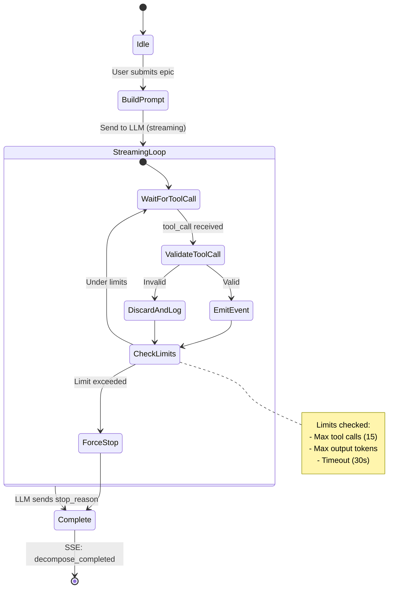

### 4.5 Validation Rules

| Rule | Check | On Failure |
|---|---|---|
| Required Fields | `title` and `order` must be present | Discard subtask, continue |
| Title Length | 1–100 characters | Truncate or discard |
| Title Uniqueness | Levenshtein similarity < 0.8 against existing | Discard duplicate |
| Estimated Hours | 0 < hours ≤ 72 | Clamp to valid range |
| Priority Enum | Must be `high`, `medium`, or `low` | Default to `medium` |
| Order Range | 1 ≤ order ≤ maxToolCalls | Auto-increment |
| Injection Guard | Strip HTML/script tags from all string fields | Sanitize in place |

> [!WARNING]
> A single invalid subtask does **NOT** abort the entire decomposition.
> The harness discards the invalid item and continues processing remaining tool calls.

---

## 5. Communication Protocol

### 5.1 SSE Event Types

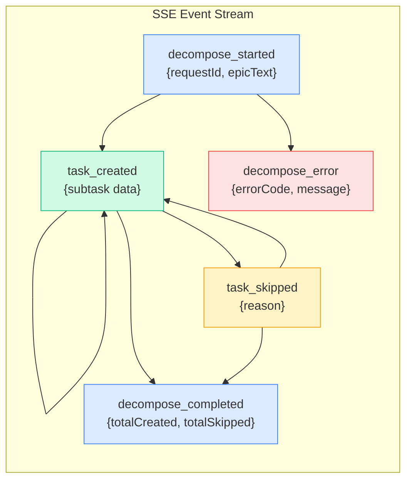

### 5.2 SSE Event Payloads

```typescript
// Event: decompose_started
interface DecomposeStartedEvent {
  readonly type: 'decompose_started';
  readonly requestId: string;
  readonly epicText: string;
  readonly timestamp: string;
}

// Event: task_created
interface TaskCreatedEvent {
  readonly type: 'task_created';
  readonly requestId: string;
  readonly subtask: {
    readonly tempId: string;      // Client-side temporary ID
    readonly title: string;
    readonly description?: string;
    readonly estimatedHours?: number;
    readonly priority?: 'high' | 'medium' | 'low';
    readonly order: number;
  };
  readonly progress: {
    readonly created: number;     // Total created so far
    readonly maxExpected: number;  // Max allowed
  };
}

// Event: task_skipped
interface TaskSkippedEvent {
  readonly type: 'task_skipped';
  readonly requestId: string;
  readonly reason: string;
}

// Event: decompose_completed
interface DecomposeCompletedEvent {
  readonly type: 'decompose_completed';
  readonly requestId: string;
  readonly summary: {
    readonly totalCreated: number;
    readonly totalSkipped: number;
    readonly processingTimeMs: number;
  };
}

// Event: decompose_error
interface DecomposeErrorEvent {
  readonly type: 'decompose_error';
  readonly requestId: string;
  readonly error: {
    readonly code: 'LLM_API_ERROR' | 'TIMEOUT' | 'RATE_LIMIT' | 'INTERNAL';
    readonly message: string;
    readonly retryable: boolean;
  };
}
```

### 5.3 Why SSE over WebSocket

| Factor | SSE | WebSocket |
|---|---|---|
| Direction | Server → Client (sufficient) | Bidirectional (overkill) |
| Complexity | Simple HTTP-based | Connection management overhead |
| Auto-reconnect | Built-in browser support | Manual implementation needed |
| API Gateway support | Native (via Lambda streaming) | Requires separate WebSocket API |
| LLM streaming fit | Direct pipeline from LLM stream | Requires message framing |

---

## 6. Data Model Extension

### 6.1 Conceptual Schema Changes

The AI feature extends the existing Task model with new fields. These changes are applied **only in the frontend state** during the draft phase; confirmed tasks use the existing DynamoDB schema.

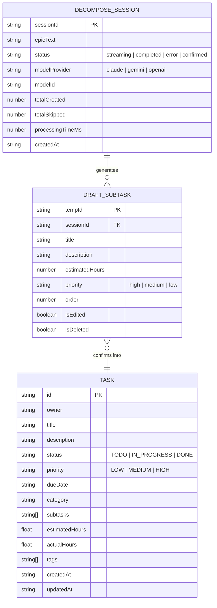

> [!NOTE]
> `DECOMPOSE_SESSION` and `DRAFT_SUBTASK` are **frontend-only state objects** during the prototype phase.
> They are NOT persisted to DynamoDB until the user clicks "Confirm All", at which point each `DRAFT_SUBTASK` becomes a regular `TASK` via the existing `createTask` mutation.

### 6.2 Draft-to-Confirmed Mapping

| Draft Field | Task Field | Transformation |
|---|---|---|
| `title` | `title` | Direct copy |
| `description` | `description` | Direct copy |
| `estimatedHours` | `estimatedHours` | Direct copy |
| `priority` | `priority` | `"high"` → `"HIGH"` (uppercase) |
| `order` | — | Used for UI ordering only |
| — | `status` | Always set to `"TODO"` |
| — | `category` | Inherited from parent epic (if set) |
| — | `tags` | `["ai-generated"]` tag added |

---

## 7. Frontend Integration

### 7.1 Component Architecture

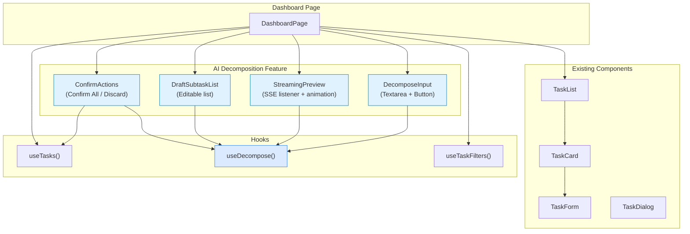

### 7.2 `useDecompose()` Hook — State Machine

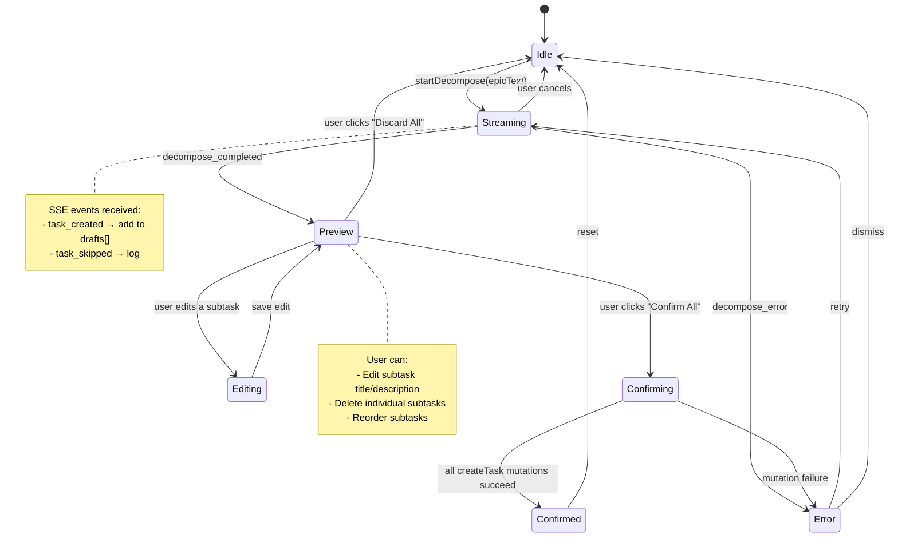

### 7.3 UX States

| State | UI Behavior |
|---|---|
| **Idle** | Show decompose input panel with textarea and "Decompose" button |
| **Streaming** | Show progress indicator ("AI is decomposing..."), subtasks fade-in one by one |
| **Preview** | Show all draft subtasks with edit/delete controls, "Confirm All" and "Discard All" buttons |
| **Editing** | Inline edit mode for a single subtask |
| **Confirming** | Loading spinner on "Confirm All" button, disable all controls |
| **Confirmed** | Success toast: "N tasks created", drafts transition to confirmed tasks in the list |
| **Error** | Error banner with message + "Retry" button, partial results preserved |

---

## 8. Cost Optimization Strategy

### 8.1 Cost Breakdown (Per Decomposition Request)

Assuming Claude Haiku 4.5, generating 10 subtasks:

| Component | Tokens | Cost |
|---|---|---|
| System Prompt (cached) | ~1,500 input | $0.00015 (90% cache discount) |
| User Input | ~100 input | $0.0001 |
| Tool Calls (10×) | ~2,000 output | $0.01 |
| **Total per request** | | **~$0.01** |

### 8.2 Cost Control Mechanisms

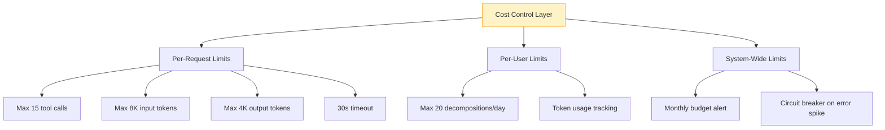

### 8.3 Future Cost Optimizations

- **Batch API**: For non-real-time re-analysis (50% discount on supported providers)
- **Model Escalation**: Use cheaper model by default; escalate to Sonnet/GPT-4o only when quality metrics indicate need
- **Response Caching**: Cache decomposition results for identical or near-identical epic texts

---

## 9. Security Considerations

### 9.1 Prompt Injection Mitigation

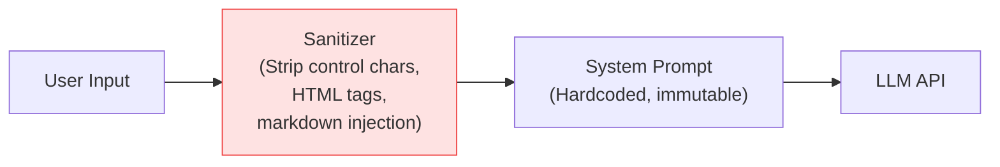

- **System prompt and user input are strictly separated** in the API call
- User input is sanitized before being embedded in the prompt
- Tool Use mode constrains output to structured data only (no free-text that could leak system prompt)
- `tool_choice` is forced, preventing the model from generating arbitrary text responses

### 9.2 Authentication Flow

- Existing Cognito JWT is forwarded to the AI Service API Gateway
- API Gateway Authorizer validates the JWT before invoking Lambda
- No additional auth mechanism needed — **Cognito is the single shared resource**

### 9.3 Cognito User-Based Throttling (Rate Limiting)

To prevent the "Noisy Neighbor" problem where a single user or a client-side infinite loop consumes the entire API Gateway capacity and exhausts the LLM API quota:

- **Token Bucket Algorithm**: Implemented at the Lambda / API Gateway layer (using a lightweight DynamoDB-based token bucket schema, isolated from the `Tasks` table).
- **Limits**: Every authenticated user is limited to:
  - Max 5 concurrent decomposition requests.
  - Max 20 decomposition requests per day.
- **Enforcement**: If a user exceeds these limits, the API returns a `429 Too Many Requests` HTTP status code without invoking the LLM API.

### 9.4 Strict Input Validation

To mitigate prompt injection, avoid processing corrupted data, and save LLM token costs:

- **API Gateway Request Validation**:
  - Validates that the request body conforms to the expected JSON schema (e.g. `epicText` must be a string).
- **Lambda Handler Validation**:
  - **Length Guard**: The `epicText` must be between 1 and 1000 characters. Requests outside this range are rejected immediately with a `400 Bad Request`.
  - **Character Sanitization**: Non-printable characters and control characters are stripped. HTML tags and script-like patterns (e.g., `<script>`) are sanitized to prevent injection attacks.

### 9.5 CloudWatch Log Masking

To prevent exposing Personally Identifiable Information (PII) or confidential user tasks in system logs (for GDPR and security compliance):

- **Data Minimization**: The raw `epicText` input and raw generated subtask titles are **never** logged to CloudWatch Logs in their entirety.
- **Log Scrubber Middleware**: All logging utilities automatically pass string parameters through a scrubbing filter:
  - Phone numbers, email addresses, and typical API credentials are detected using regex patterns and replaced with `[MASKED]`.
  - For debugging, logs only output metadata (e.g., request ID, text length in characters, token count, processing time) instead of raw user-supplied strings.

---

## 10. Error Handling Matrix

| Error Scenario | Detection | User Impact | Recovery |
|---|---|---|---|
| LLM API timeout | 30s deadline exceeded | "Generation timed out" message | "Retry" button; partial results preserved |
| LLM API rate limit | 429 status code | "Service busy" message | Auto-retry with exponential backoff (3 attempts) |
| LLM API down | 5xx status code | "AI service unavailable" banner | Fallback to manual task creation |
| Invalid tool call output | Validation layer rejection | Subtask silently skipped | Processing continues; skipped count shown in summary |
| All subtasks invalid | 0 valid after full loop | "Could not generate valid subtasks" | "Retry" button with suggestion to rephrase |
| SSE connection drop | EventSource error event | "Connection lost" message | Auto-reconnect with resume from last event |
| Confirm mutation failure | AppSync error response | "Failed to save task X" | Per-task retry; successful saves are kept |

---

## 11. Technology Stack Summary

| Layer | Technology | Rationale |
|---|---|---|
| **Frontend** | Next.js (App Router), TypeScript, Tailwind CSS, shadcn/ui | Existing stack — no changes needed |
| **Frontend State** | SWR + React state (useDecompose hook) | SWR for confirmed tasks; React state for draft lifecycle |
| **Real-time** | SSE (Server-Sent Events) | Simpler than WebSocket; natural fit for LLM streaming |
| **AI Backend** | Python (Lambda) | Matches existing `ai-service/` directory; rich LLM SDK ecosystem |
| **API** | API Gateway (REST) + Lambda | Serverless; pay-per-use; Cognito JWT integration |
| **LLM** | Claude Haiku 4.5 (default), swappable to Gemini/GPT | Adapter pattern; config-driven switching |
| **Auth** | Cognito User Pool (shared) | Single shared resource between Amplify and AI service |
| **DB** | DynamoDB (existing Tasks table, via AppSync) | No direct AI service access; tasks saved via frontend → AppSync |
| **Observability** | CloudWatch (future Phase 2) | Latency, error rate, token usage metrics |

---

## 12. File Structure (Proposed)

```
ai-service/
├── config/
│   └── model_config.py        # Model configuration + defaults
├── adapters/
│   ├── base.py                # LLMAdapter interface (ABC)
│   ├── claude_adapter.py      # Claude API implementation
│   ├── gemini_adapter.py      # Gemini API implementation
│   ├── openai_adapter.py      # OpenAI API implementation
│   └── factory.py             # AdapterFactory
├── harness/
│   ├── prompt_engine.py       # System prompt template + few-shot
│   ├── tool_definitions.py    # create_subtask tool schema
│   ├── execution_controller.py # Loop control + limits
│   ├── validator.py           # Field validation + dedup
│   └── event_emitter.py       # SSE event formatting
├── handlers/
│   └── decompose_handler.py   # Lambda entry point
├── prompts/
│   └── v1/
│       ├── system.txt         # System prompt template
│       └── few_shot.json      # Few-shot examples
├── tests/
│   ├── test_validator.py
│   ├── test_adapters.py
│   └── test_harness.py
├── requirements.txt
└── main.py

web/src/
├── hooks/
│   └── useDecompose.ts        # SSE + draft state management
├── components/
│   ├── DecomposeInput.tsx     # Epic input panel
│   ├── StreamingPreview.tsx   # Real-time subtask preview
│   ├── DraftSubtaskList.tsx   # Editable draft list
│   └── ConfirmActions.tsx     # Confirm/Discard buttons
└── lib/
    └── ai-service-client.ts   # API client for AI service
```

---

## 13. Open Questions & Future Considerations

> [!IMPORTANT]
> The following items need resolution before or during implementation:

| # | Question | Options | Impact |
|---|---|---|---|
| 1 | Should draft subtasks be persisted server-side? | A) Frontend-only (simpler) B) DynamoDB draft table (resumable) | Affects data model and recovery |
| 2 | How to handle SSE with Lambda? | A) Lambda response streaming B) Step Functions + SQS C) AppSync subscriptions | Affects latency and complexity |
| 3 | Subtask granularity control | A) Hardcoded in prompt B) User-adjustable slider | Affects UX and prompt design |
| 4 | Model fallback strategy | A) Single model, manual switch B) Auto-escalation on quality signal | Affects cost and reliability |
| 5 | Rate limiting per user | A) API Gateway throttling B) Custom token bucket in DynamoDB | Affects cost control |
