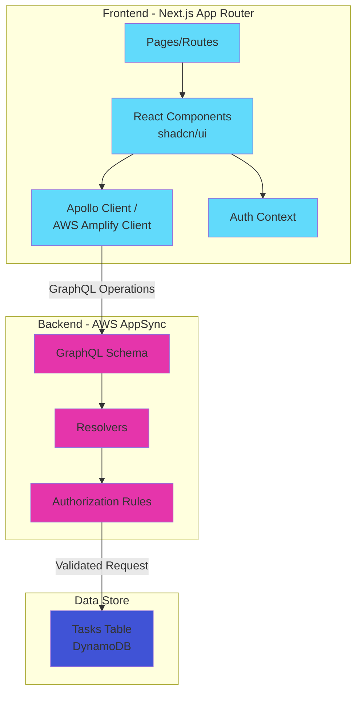
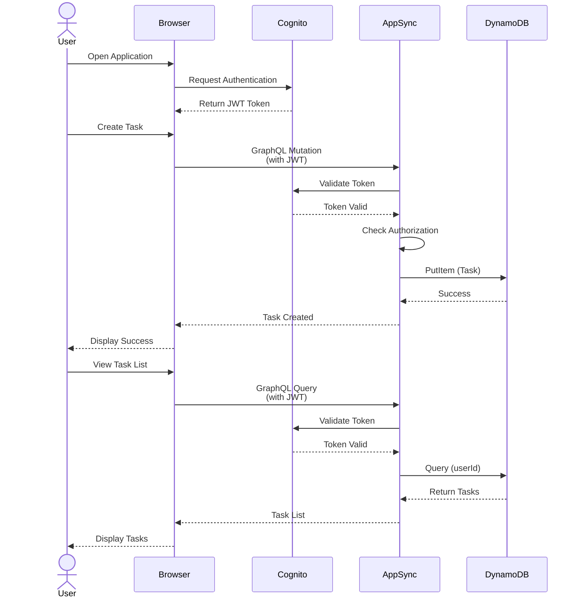

# Requirements Specification: My Roadmap

## 1. Project Overview

**Project Name:** My Roadmap  
**Purpose:** A learning task management application designed to help users track and organize their learning tasks systematically.

**Target Users:**
- Individuals managing self-paced learning goals
- Users who need structured task tracking for skill development

---

## 2. Core Features (Phase 1 - MVP)

### 2.1 Learning Task Management

The primary feature of this application is to manage learning tasks with the following essential attributes:

#### Task Properties

| Property | Type | Required | Description |
|----------|------|----------|-------------|
| **Title** | String | Yes | Name of the learning task (e.g., "Learn Next.js App Router") |
| **Status** | Enum | Yes | Current state of the task: `NOT_STARTED`, `IN_PROGRESS`, `COMPLETED` |
| **Priority** | Enum | Yes | Task priority level: `HIGH`, `MEDIUM`, `LOW` |
| **Due Date** | Date | Yes | Target completion date |
| **Category** | String | Yes | Learning domain (e.g., "Frontend", "Backend", "Infrastructure", "Algorithm") |

#### Status Definitions

- **NOT_STARTED**: Task has been created but not yet begun
- **IN_PROGRESS**: User is actively working on this task
- **COMPLETED**: Task has been finished successfully

---

## 3. Functional Requirements

### 3.1 Task CRUD Operations

- **FR-1.1**: Users shall be able to create a new learning task with all required properties
- **FR-1.2**: Users shall be able to view a list of all learning tasks
- **FR-1.3**: Users shall be able to update any property of an existing task
- **FR-1.4**: Users shall be able to delete a learning task
- **FR-1.5**: Users shall be able to change the status of a task (NOT_STARTED → IN_PROGRESS → COMPLETED)

### 3.2 Task Filtering and Sorting

- **FR-2.1**: Users shall be able to filter tasks by status
- **FR-2.2**: Users shall be able to filter tasks by priority
- **FR-2.3**: Users shall be able to filter tasks by category
- **FR-2.4**: Users shall be able to sort tasks by due date
- **FR-2.5**: Users shall be able to sort tasks by priority

### 3.3 Task Visualization

- **FR-3.1**: Users shall see a clear visual representation of task status
- **FR-3.2**: Users shall see priority indicators (e.g., color coding)
- **FR-3.3**: Users shall see upcoming deadlines highlighted

---

## 4. Non-Functional Requirements

### 4.1 Performance

- **NFR-1.1**: Task list shall load within 2 seconds
- **NFR-1.2**: Task CRUD operations shall complete within 1 second

### 4.2 Usability

- **NFR-2.1**: UI shall be responsive and work on desktop and mobile devices
- **NFR-2.2**: UI shall follow modern design principles (clean, intuitive)
- **NFR-2.3**: Application shall be accessible (WCAG 2.1 Level AA compliance)

### 4.3 Security

- **NFR-3.1**: Users shall authenticate via AWS Cognito
- **NFR-3.2**: Users shall only access their own tasks (data isolation)
- **NFR-3.3**: All API requests shall be authenticated and authorized

### 4.4 Scalability

- **NFR-4.1**: System shall support up to 1,000 tasks per user
- **NFR-4.2**: System shall handle concurrent users efficiently

---

## 5. System Architecture

### 5.1 Infrastructure Architecture

The following diagram illustrates the AWS infrastructure and service integration:

```mermaid
graph TB
    subgraph "Client Layer"
        Browser[Web Browser]
    end
    
    subgraph "AWS Cloud"
        subgraph "Frontend Hosting"
            Amplify[AWS Amplify Hosting]
            CloudFront[Amazon CloudFront CDN]
        end
        
        subgraph "Authentication"
            Cognito[Amazon Cognito]
        end
        
        subgraph "API Layer"
            AppSync[AWS AppSync<br/>GraphQL API]
        end
        
        subgraph "Data Layer"
            DynamoDB[(Amazon DynamoDB)]
        end
        
        subgraph "CI/CD"
            GitHub[GitHub Repository]
            Actions[GitHub Actions]
        end
    end
    
    Browser -->|HTTPS| CloudFront
    CloudFront --> Amplify
    Browser -->|Auth Request| Cognito
    Browser -->|GraphQL Query/Mutation| AppSync
    AppSync -->|Verify Token| Cognito
    AppSync -->|Read/Write| DynamoDB
    
    GitHub -->|Push| Actions
    Actions -->|Deploy| Amplify
    
    style Browser fill:#e1f5ff
    style Amplify fill:#ff9900
    style CloudFront fill:#ff9900
    style Cognito fill:#ff9900
    style AppSync fill:#ff9900
    style DynamoDB fill:#ff9900
    style GitHub fill:#24292e
    style Actions fill:#2088ff
```



### 5.2 Application Architecture

The following diagram shows the application layer structure:



### 5.3 Data Flow Diagram

The following diagram illustrates a typical user interaction flow:



---

## 6. Technical Stack

### Frontend
- **Framework**: Next.js (App Router)
- **Language**: TypeScript
- **Styling**: Tailwind CSS
- **UI Components**: shadcn/ui

### Backend
- **Infrastructure**: AWS Amplify Gen 2 (TypeScript-based IaC)
- **Authentication**: AWS Cognito
- **Database**: Amazon DynamoDB
- **API**: AWS AppSync (GraphQL)

### CI/CD
- **Version Control**: GitHub
- **Pipeline**: GitHub Actions

---

## 6. Data Model (Phase 1)

### Task Entity

```typescript
interface Task {
  id: string;                    // Unique identifier (UUID)
  userId: string;                // Owner of the task (from Cognito)
  title: string;                 // Task name
  status: 'NOT_STARTED' | 'IN_PROGRESS' | 'COMPLETED';
  priority: 'HIGH' | 'MEDIUM' | 'LOW';
  dueDate: string;               // ISO 8601 date format
  category: string;              // Learning domain
  createdAt: string;             // ISO 8601 timestamp
  updatedAt: string;             // ISO 8601 timestamp
}
```

### DynamoDB Table Design

- **Table Name**: `Tasks`
- **Partition Key**: `userId` (String)
- **Sort Key**: `id` (String)
- **GSI (Global Secondary Index)**: 
  - `StatusIndex`: Partition Key = `userId`, Sort Key = `status`
  - `DueDateIndex`: Partition Key = `userId`, Sort Key = `dueDate`

---

## 7. User Stories (Phase 1)

### Epic: Task Management

**US-1**: As a learner, I want to create a new learning task so that I can track what I need to study.

**US-2**: As a learner, I want to view all my tasks in a list so that I can see my learning roadmap at a glance.

**US-3**: As a learner, I want to update a task's status to "In Progress" when I start working on it, so that I can track my current focus.

**US-4**: As a learner, I want to mark a task as "Completed" when I finish it, so that I can see my progress.

**US-5**: As a learner, I want to set a priority for each task so that I can focus on the most important items first.

**US-6**: As a learner, I want to set a due date for each task so that I can manage my time effectively.

**US-7**: As a learner, I want to filter tasks by status so that I can focus on tasks that are in progress or not yet started.

**US-8**: As a learner, I want to categorize tasks (Frontend, Backend, etc.) so that I can organize my learning by domain.

---

## 8. Out of Scope (Future Phases)

The following features are **not included in Phase 1** but may be considered for future iterations:

- Subtasks / nested tasks
- Time tracking (estimated hours, actual hours)
- Learning resources (URLs, notes)
- Progress percentage
- Achievement tracking
- Collaboration features
- Skill tree integration
- Difficulty levels
- Tags and advanced search
- Analytics and insights

---

## 9. Success Criteria

Phase 1 will be considered successful when:

1. Users can perform full CRUD operations on learning tasks
2. Users can filter and sort tasks by status, priority, category, and due date
3. The application is deployed on AWS with authentication
4. The UI is responsive and follows modern design standards
5. All core functional requirements (FR-1.x, FR-2.x, FR-3.x) are implemented
6. The codebase follows TypeScript best practices and maintains type safety

---

## 10. Acceptance Criteria

- [ ] User can sign up and log in via AWS Cognito
- [ ] User can create a task with title, status, priority, due date, and category
- [ ] User can view a list of all their tasks
- [ ] User can edit any task property
- [ ] User can delete a task
- [ ] User can change task status (NOT_STARTED → IN_PROGRESS → COMPLETED)
- [ ] User can filter tasks by status, priority, and category
- [ ] User can sort tasks by due date and priority
- [ ] UI is responsive on desktop and mobile
- [ ] Application is deployed to AWS and accessible via HTTPS
- [ ] Code follows TypeScript best practices and includes type safety
- [ ] README includes setup instructions and project overview

---

## Document Information

- **Version**: 1.0.0
- **Last Updated**: 2026-02-16
- **Author**: John ([github](https://github.com/vanilla2412))
- **Status**: Draft


