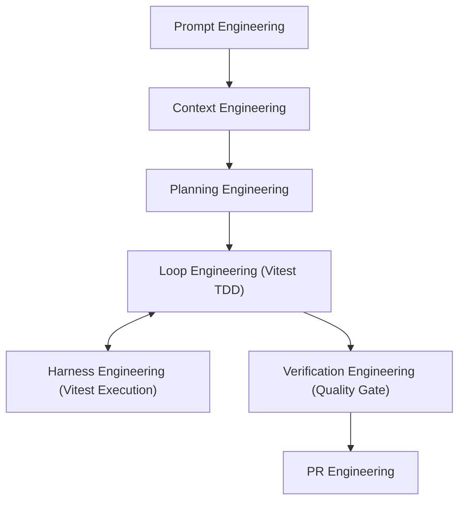

# Test Strategy and Defect Management

This document defines the testing approach, quality standards, and autonomous AI engineering loop integration for the "My Roadmap" project.

---

## 1. Testing Strategy

We follow the testing pyramid approach, prioritizing unit and integration tests for speed and reliability.

### 1.1 Testing Levels

| Level | Scope | Tools | Frequency |
| :--- | :--- | :--- | :--- |
| **Unit Test** | Pure functions, individual hooks, utility logic | Vitest | Every PR / Local dev |
| **Component Test** | UI components (shadcn/ui), form interactions | Vitest + React Testing Library | Every PR / Local dev |
| **Integration Test** | Amplify GraphQL API, Auth flows | Manual (Amplify Sandbox) | Major feature updates |
| **E2E Test** | Full user journeys | Playwright (Future) | Post-MVP |

### 1.2 Responsibilities

- **Developers**: Responsible for writing unit and component tests for every new feature.
- **AI Agent**: Responsible for maintaining test infrastructure, driving autonomous TDD loops, and generating initial test boilerplate.

---

## 2. Defect Management

### 2.1 Issue Tracking
- All bugs must be reported as GitHub Issues with the `bug` label.
- Reports should include:
  - Steps to reproduce
  - Expected vs. Actual behavior
  - Environment details (Browser, OS)

### 2.2 Severity Levels

| Level | Description | Priority |
| :--- | :--- | :--- |
| **P0 (Critical)** | Core functionality broken (Auth, DB), Security leak | Immediate Fix |
| **P1 (High)** | Major feature broken, UI/UX severely impacted | Next Sprint |
| **P2 (Medium)** | Minor feature bug, edge case issues | As scheduled |
| **P3 (Low)** | Stylistic issues, minor typos | Backlog |

---

## 3. Tooling and Environment

- **Runner**: [Vitest](https://vitest.dev/) (`cd web && npx vitest run`)
- **Environment**: [jsdom](https://github.com/jsdom/jsdom)
- **Component Mocking**: [React Testing Library](https://testing-library.com/docs/react-testing-library/intro/)
- **Coverage Tool**: Vitest Coverage (`cd web && npx vitest run --coverage`) — Minimum 80% threshold required.
- **CI Integration**: GitHub Actions runs unit tests on every PR to `main`.

---

## 4. Autonomous AI Engineering Loop & Vitest Integration

The project incorporates an **Agent-First Engineering Operating System** comprising 7 composable workflow modules. Vitest serves as the core verification and TDD engine within this autonomous architecture.

### 4.1 Vitest-Powered TDD Execution Cycle (`/loop-engineering`)

Autonomous AI agents execute code modifications following a strict Test-Driven Development (TDD) cycle driven by Vitest:

1. **RED Phase (Failing Test First)**:
   - The agent writes or updates unit/component tests covering target requirements.
   - Vitest is executed via **Harness Engineering** (`.agent/workflows/harness-engineering.md`) running `cd web && npx vitest run` to confirm the test **FAILS** as expected.
2. **GREEN Phase (Minimal Implementation)**:
   - The agent implements the minimal production code necessary to pass the failing test.
   - Vitest is re-run to confirm the test **PASSES**.
3. **REFACTOR Phase**:
   - Code is cleaned, modularized, and checked for immutability while keeping Vitest tests green.

### 4.2 Automated Verification & Quality Gates (`/verification-engineering`)

Before any Pull Request is generated:
- **Full Test Suite Execution**: Vitest runs all unit and component tests.
- **Coverage Audit**: Vitest coverage must meet or exceed **80%** (100% required for security and authentication logic).
- **Circuit Breaker Policy**: If a test failure persists after **3 consecutive self-correction retries**, the agent halts execution, reverts to the last git checkpoint (`git checkout -- .`), and alerts the human developer.
